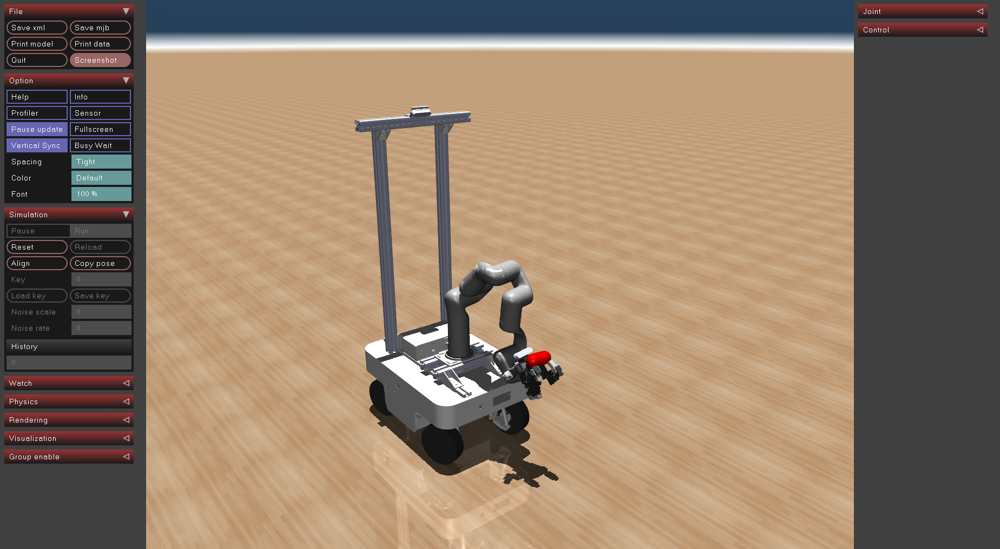

<div align="center">

# Catch It! — 基于强化学习的移动机械臂动态目标跟踪

**Reinforcement Learning for Dynamic Target Tracking with a Mobile Manipulator**

基于 **MuJoCo + Gymnasium + PyTorch + PPO** 的移动操作机器人仿真与强化学习项目。

[项目代码](https://github.com/jack-huangs/catch_it) · [训练配置](configs/config.yaml) · [毕业设计论文初稿](毕业设计论文/基于强化学习的移动机械臂目标跟踪系统设计与实现_初稿.md)

</div>

---

## 📖 项目简介

本项目围绕**移动机械臂对空中运动目标的动态跟踪**展开：在 MuJoCo 中搭建由移动底盘、七自由度机械臂和夹爪组成的 **TidyBot** 机器人平台，向机器人前方抛出随机化物体，通过 **Proximal Policy Optimization（PPO，近端策略优化）** 学习底盘与机械臂的联合控制策略，使夹爪末端尽可能接近并接触飞行目标。

这是一个以**本科毕业设计 / 研究实验**为背景的强化学习仿真工程。工作重点是对已有 DCMM / *Catch It!* 代码框架进行机器人模型迁移、奖励函数重新设计、全部视觉算法构建。

> **当前项目状态：** 仓库当前主要支持 **Tracking（目标跟踪 / 末端接近）**。原代码保留了 `Catching_TwoStage`、`Catching_OneStage` 的 PPO 实现，但当前 `DcmmVecEnv` 环境构造函数仅允许 `Tracking`，因此不能直接把这两种 Catching 模式视为现成可运行的功能。

### 仿真预览



<details>
<summary>查看仓库中的演示动图（GIF 文件较大）</summary>


</details>

> 图片与 GIF 为仓库中已有的演示素材，仅用于展示仿真场景；不代表当前 Tracking 策略已达到稳定接球或真实机器人部署效果。

## ✨ 主要工作

- **机器人模型迁移：** 将原有任务中的机器人模型适配到 TidyBot（移动底盘 + 7-DoF 机械臂 + 夹爪），重新整理 MuJoCo 的关节、执行器、末端 `site` 和碰撞几何体映射。
- **动态目标场景：** 在仿真环境中生成并抛掷目标物体，支持物体初始位置、速度、形状、质量等参数设置与随机化。
- **状态驱动的强化学习：** 使用机器人运动状态、末端状态和目标位置/速度作为策略输入，以 PPO 学习连续控制动作；**当前策略不是直接从 RGB 图像端到端预测动作**。
- **移动底盘与机械臂协同控制：** 策略输出 2 维底盘控制量与 7 维机械臂关节增量，交由底层 MuJoCo 控制链执行。
- **奖励与训练优化：** 综合目标距离、精细逼近、姿态、近距离奖励，以及动作幅度、碰撞和关节约束惩罚；调整初始姿态、来球方向及控制噪声以改善训练稳定性。
- **实验工具：** 提供 Hydra 配置、向量化环境训练、TensorBoard / Weights & Biases 日志、模型 checkpoint，以及键盘手动调试脚本。

## 🏗️ 系统架构

```text
                     configs/config.yaml
               configs/train/DcmmPPO.yaml
                  configs/env/DcmmCfg.py
                            │
                            ▼
                      train_DCMM.py
                            │
                Gymnasium Vector Envs
                            │
                            ▼
                  DcmmVecEnv (Tracking)
                     │             ▲
         observation │             │ action / reward / done
                     ▼             │
                PPO_Track Agent ────┘
                 │          │
             Actor MLP   Critic MLP
                 │          │
              actions      V(s)
                 │
                 ▼
         MujocoDcmm / MuJoCo
          ├─ 移动底盘运动
          ├─ 7-DoF 机械臂关节控制
          └─ 目标物体运动与接触检测
```

项目使用 Actor-Critic 结构：Actor 为每个动作维度建立高斯策略分布，Critic 估计状态价值；通过采样轨迹、GAE 优势估计与 PPO 裁剪目标更新策略。默认 Actor、Critic 分别使用隐藏层为 **[256, 128]** 的 MLP。

### Tracking 观测与动作空间

当前策略采用**25 维状态观测、9 维有效动作**（另有 1 维夹爪状态与动作接口保留于环境中，但不参与 Tracking 策略输入/输出）。

| 观测项 | 维度 | 内容 |
| --- | ---: | --- |
| `base.v_lin_2d` | 2 | 移动底盘二维速度 |
| `arm.ee_pos3d` | 3 | 末端相对三维位置 |
| `arm.ee_quat` | 4 | 末端相对姿态四元数 |
| `arm.ee_v_lin_3d` | 3 | 末端三维线速度 |
| `arm.joint_pos` | 7 | 七自由度机械臂关节角 |
| `object.pos3d` | 3 | 目标相对三维位置 |
| `object.v_lin_3d` | 3 | 目标三维线速度 |
| **合计** | **25** | |

| 策略动作 | 维度 | 内容 |
| --- | ---: | --- |
| `base` | 2 | 底盘平面控制量 |
| `arm` | 7 | 七个关节的增量控制量 |
| **合计** | **9** | |

环境可通过 wrist 相机渲染 RGB / 深度图像，但当前 `PPO_Track` 的核心策略输入是上述仿真状态，不是图像特征。

### 奖励与成功条件

Tracking 奖励主要包含末端距离改善、末端精细接近、近距离加分、姿态引导、底盘距离改善，以及控制动作、碰撞和约束相关惩罚。权重定义在 [`configs/env/DcmmCfg.py`](configs/env/DcmmCfg.py)，计算逻辑在 [`DcmmVecEnv.compute_reward()`](gym_dcmm/envs/DcmmVecEnv.py)。

按照当前代码，当夹爪指定接触区域与目标发生接触，**或**夹爪末端到目标的距离小于 `tracking_success_thresh = 0.02 m`，就会触发 Tracking 成功标志。这里的“成功”是仿真任务定义，不等同于稳固抓握或真实接球。

## 🚀 环境安装与快速开始

### 1. 运行环境

推荐在 **Ubuntu / Linux** 中配置环境（毕业设计实验主要在 Ubuntu 下进行）。项目使用 Python、MuJoCo、Gymnasium、PyTorch 和 Hydra，建议从 **Python 3.10** 虚拟环境开始尝试。不同 PyTorch / CUDA / 操作系统组合的兼容性需要自行核对。

```bash
# 克隆仓库
git clone https://github.com/jack-huangs/catch_it.git
cd catch_it

# 创建并激活虚拟环境（Linux / macOS）
python3 -m venv .venv
source .venv/bin/activate

# 安装项目以及 requirements.txt 中的依赖
python -m pip install --upgrade pip
python -m pip install -e .
python -m pip install -r requirements.txt

# 入口脚本还直接依赖 torch 和 pytz；它们未完整写入 requirements.txt
python -m pip install torch pytz
```

> `setup.py` 声明 `gymnasium==0.29.1`、`mujoco>=3.0.0`；`requirements.txt` 包含 `numpy==1.23`、Hydra、OmegaConf、OpenCV、wandb、tensorboardX 等。若需要 GPU，请按 [PyTorch 官方安装指引](https://pytorch.org/get-started/locally/) 安装与 CUDA 环境匹配的版本，而不是盲目沿用上面的通用 `torch` 命令。

### 2. 运行无图形冒烟测试

先确认环境可以构建，并执行少量仿真步：

```bash
python teleop_tidybot.py --headless-test
```

这个命令只做**环境级的最小测试**，不会训练策略。

### 3. 从零训练 Tracking

```bash
python train_DCMM.py task=Tracking test=false num_envs=8 device_id=0 checkpoint_tracking=null
```

- `num_envs`：并行环境数量，可根据 CPU / 内存情况调整。
- `device_id=0`：使用 `cuda:0` 训练；没有可用 CUDA 设备时，可尝试 `device_id=-1`。
- `checkpoint_tracking=null`：**从头训练时必须注意的参数**。当前默认配置填写了一个已有模型路径；不清空时，训练入口会尝试读取该 checkpoint 并继续训练。
- 默认关闭 viewer，以减轻渲染开销。首次调试可以适当降低并行环境数和总训练步数。

例如，运行较短的流程验证：

```bash
python train_DCMM.py task=Tracking test=false num_envs=2 device_id=0 checkpoint_tracking=null train.ppo.max_agent_steps=100000
```

### 4. 加载已有权重评估

仓库中保存了多个历史训练权重，例如 `assets/models/best_reward_61.07.pth`：

```bash
python train_DCMM.py task=Tracking test=true num_envs=1 device_id=0 viewer=true checkpoint_tracking=assets/models/best_reward_61.07.pth
```

也可以使用 [`configs/config.yaml`](configs/config.yaml) 中默认指定的历史 checkpoint。需要注意，不同时期的机器人结构、观测维度或网络配置可能有所调整；**旧权重能否正常加载以及最终表现应以当前代码实际测试为准**。

### 5. 键盘遥操作（调试机器人控制链）

```bash
python teleop_tidybot.py
# 如需在手动调试时显示抛掷目标：
python teleop_tidybot.py --show-object
```

| 按键 | 操作 |
| --- | --- |
| 方向键 | 调整底盘平面速度 |
| `K` | 将底盘速度指令清零 |
| `Q/A`、`W/S`、`E/D`、`R/F`、`T/G`、`Y/H`、`U/J` | 分别调整机械臂第 1～7 关节 |
| `O/P` | 夹爪开合 |
| `Space` | 重置环境 |
| `Esc` | 退出 |

该工具用于**手动验证机器人执行器、关节映射、碰撞与控制是否正常**，不代表强化学习策略运行效果。

## ⚙️ 主要配置

| 配置位置 | 用途 |
| --- | --- |
| [`configs/config.yaml`](configs/config.yaml) | 训练/测试开关、任务、设备、并行环境、可视化、checkpoint 与 wandb |
| [`configs/train/DcmmPPO.yaml`](configs/train/DcmmPPO.yaml) | PPO 网络结构、学习率、批大小、动作缩放、训练步数及模型保存 |
| [`configs/env/DcmmCfg.py`](configs/env/DcmmCfg.py) | TidyBot 模型、初始姿态、目标随机化、奖励权重及成功阈值 |

当前主配置的一组代表性参数如下（**以仓库实际配置文件为准**）：

| 参数 | 当前值 |
| --- | ---: |
| `num_envs` | `8` |
| `horizon_length` | `64` |
| `minibatch_size` | `64` |
| `mini_epochs` | `4` |
| `learning_rate` | `1e-4` |
| `gamma` | `0.99` |
| `tau`（GAE λ） | `0.95` |
| `e_clip` | `0.2` |
| `max_agent_steps` | `15,000,000` |
| `tracking_success_thresh` | `0.02 m` |

> PPO 一轮收集的样本数为 `num_envs × horizon_length`，需要能够被 `minibatch_size` 整除。更改观测或动作维度时，可能还需要同步修改策略网络和数据处理部分。

## 📈 实验输出与评估

训练输出位于：

```text
outputs/<output_name>/<日期>/<时间>/
├── nn/    # last.pth、best_reward_*.pth 等模型文件
└── tb/    # TensorBoard 事件日志
```

查看 TensorBoard：

```bash
tensorboard --logdir outputs
```

主要关注以下三类曲线：

- `metrics/episode_success_per_step`：近期已结束回合的 Tracking 任务成功比例。
- `metrics/episode_rewards_per_step`：近期回合的平均累计奖励。
- `metrics/episode_lengths_per_step`：近期回合的平均长度。

**请不要把较高 reward 直接解读为较高接触成功率。** 由于存在距离塑形奖励，策略可能学会接近物体，但仍不能稳定触及目标。毕业设计论文初稿记录的部分实验成功率较低，这也是本项目后续重点优化方向；仓库内历史 checkpoint 文件名中的数值是 reward 标记，并非成功率。

## 📁 项目目录

```text
catch_it/
├── assets/
│   ├── media/                  # 截图与演示 GIF
│   ├── meshes/                 # 机器人/场景/物体网格资源
│   ├── models/                 # 历史模型权重
│   └── urdf/stanford_tidybot2/ # TidyBot MuJoCo XML 模型
├── configs/
│   ├── config.yaml             # Hydra 主配置
│   ├── env/DcmmCfg.py          # 场景、观测噪声、奖励和任务参数
│   └── train/DcmmPPO.yaml     # PPO 网络和训练超参数
├── gym_dcmm/
│   ├── agents/MujocoDcmm.py   # MuJoCo 机器人封装与控制接口
│   ├── envs/DcmmVecEnv.py     # Gymnasium 环境、奖励、接触和终止逻辑
│   ├── algs/ppo_dcmm/         # PPO Tracking/Catching 相关实现
│   │   ├── models_track.py    # Tracking Actor-Critic 网络
│   │   ├── ppo_dcmm_track.py  # Tracking 采样、优化、测试及存档
│   │   ├── experience.py      # 经验缓存与优势估计
│   │   └── ...
│   └── utils/                 # 控制、数学、逆运动学等工具
├── outputs/                   # 历史实验结果、日志和 checkpoint
├── 毕业设计论文/                 # 毕业论文初稿等研究资料
├── train_DCMM.py              # 训练 / 测试入口
├── teleop_tidybot.py          # 手动遥操作和 headless 最小测试
├── note.md                    # 项目学习与开发笔记（可能含旧参数）
├── requirements.txt
├── setup.py
└── LICENSE
```

## 🔍 现阶段局限与后续方向

本项目目前完成了**可训练的仿真环境、机器人适配与 PPO 训练主链路**，但依然存在以下待解决问题：

1. **跟踪成功率与稳定性：** 策略的逼近能力和严格目标接触之间仍有差距，尚不能保证稳定完成动态接触。
2. **底盘–机械臂协同：** 需要进一步优化底盘参与程度、动作平滑性和奖励结构。
3. **任务范围：** 当前环境只实现 Tracking；完整接球、稳定抓握与两阶段 Catching 仍需额外工程适配与验证。
4. **真实部署：** 策略目前依赖仿真中的目标和机器人状态，尚未完成视觉感知闭环及 sim-to-real 验证。
5. **复现环境：** 依赖未完全锁定，部分权重与配置来自不同实验版本；建议记录 CUDA、PyTorch、MuJoCo、Python 版本并进行独立回归测试。

## 📚 参考与致谢

本仓库的基础框架与研究背景涉及如下工作：

- Zhang 等，[*Catch It! Learning to Catch in Flight with Mobile Dexterous Hands*](https://arxiv.org/abs/2409.10319)，2024。
- Schulman 等，[*Proximal Policy Optimization Algorithms*](https://arxiv.org/abs/1707.06347)，2017。
- [MuJoCo](https://mujoco.org/) 物理仿真引擎、[Gymnasium](https://gymnasium.farama.org/) 强化学习环境接口，以及 [PyTorch](https://pytorch.org/) 深度学习框架。

感谢相关开源项目与研究工作的贡献。本项目对原有移动灵巧操作任务进行了以 **TidyBot + Tracking** 为核心的工程适配与实验探索。

## 📄 License

本仓库包含 [`MIT License`](LICENSE) 许可文件，现有版权声明为 **Copyright (c) 2025 Yuanhang Zhang**。使用、复制与分发时请遵守仓库实际许可条款并保留适当的原始署名。

---

<div align="center"><sub>Research / Graduation Project · MuJoCo · PPO · Mobile Manipulation</sub></div>
