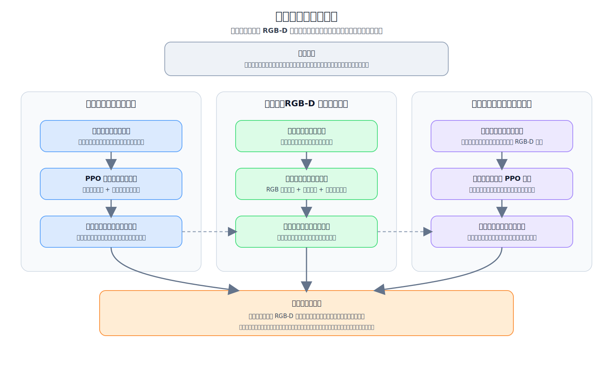

# 基于强化学习与 RGB-D 视觉感知的移动机械臂协同动态目标触碰方法研究

## 写作说明

本文档作为毕业论文 Markdown 草稿文件，用于逐步整理以下内容：

- 论文题目
- 摘要
- 关键词
- 正文章节
- 实验结果
- 结论与展望

当前项目研究对象为：

- 移动底盘 + 机械臂组成的移动机械臂系统
- 面向抛来动态目标的触碰任务
- 控制方法采用 PPO 强化学习
- 感知方式从 MuJoCo 真值状态逐步过渡到 RGB-D 视觉观测

需要特别注意：

- 本文核心任务是“动态目标触碰”，不是“稳定抓取”或“完整接球”
- 论文中应避免把当前任务直接表述为“接住物体”，除非明确说明只是参考相关捕获任务背景

## 论文建议图片清单

为保证论文篇幅、可读性和表达效果，建议提前准备并整理以下图片素材。后续正文中可按章节插入。

### 一、系统与硬件类图片

1. 机器人仿真模型整体图
2. 机器人真实平台照片
3. 机械臂局部结构图
4. 底盘结构图
5. 夹爪末端特写图
6. RGB-D 相机安装位置图
7. 实验室真实相机照片
8. 机器人与相机整体安装实物图

### 二、任务与流程类图片

9. 动态目标触碰任务场景图
10. 目标抛掷轨迹示意图
11. 系统总体流程图
12. 训练流程图
13. 视觉检测与状态估计流程图
14. PPO 控制框架图
15. 真值观测与视觉观测切换示意图

### 三、视觉感知类图片

16. base 相机视角 RGB 图
17. wrist 相机视角 RGB 图
18. 深度图示例
19. 红色目标检测结果图
20. 深度反投影示意图
21. 相机坐标系到机器人坐标系转换示意图
22. 不同相机安装位置对比图
23. 不同 FOV 对比图

### 四、训练与结果类图片

24. reward 曲线图
25. success 曲线图
26. episode length 曲线图
27. 真值版与视觉版成功率柱状图
28. 不同模型测试结果对比表图
29. 视觉位置误差统计图
30. 视觉速度误差统计图
31. 相机位置实验对比图
32. 测试成功案例连续截图
33. 测试失败案例连续截图
34. 真值版与视觉版策略行为对比图

### 五、建议优先准备的图片

如果时间有限，优先准备以下 12 类：

1. 机器人仿真模型图
2. 机器人真实平台照片
3. RGB-D 相机安装位置图
4. 动态目标触碰任务场景图
5. 系统总体流程图
6. 训练流程图
7. 视觉检测结果图
8. 深度图示例
9. reward 曲线
10. success 曲线
11. 真值版与视觉版对比图
12. 成功案例截图

## 全文字数与篇幅规划

本论文计划控制在约 50 页、约 1.6 万字左右。按照常见本科论文排版习惯，正文可按照以下篇幅进行分配：

- 第一章 绪论：约 2500~3000 字
- 第二章 相关技术与系统建模：约 2500~3000 字
- 第三章 基于真值状态的移动机械臂协同动态目标触碰方法：约 2500 字
- 第四章 基于 RGB-D 视觉感知的动态目标状态估计方法：约 2500 字
- 第五章 融合视觉观测的移动机械臂协同动态目标触碰方法：约 2000~2500 字
- 第六章 实验设计与结果分析：约 3000~4000 字
- 第七章 总结与展望：约 1000~1500 字

如果后续加入较多图、表和公式，那么文字量不必刻意过多；如果图表较少，则需要适当扩充实验分析和相关工作部分的文字内容。

---

## 论文题目

基于强化学习与 RGB-D 视觉感知的移动机械臂协同动态目标触碰方法研究

---

## 中文摘要

移动机械臂在仓储分拣、家庭服务、移动作业和动态交互等场景中具有较高的应用价值。与固定机械臂相比，移动机械臂同时具备平台机动性与末端操作能力，因此可以覆盖更广的操作范围，但与此同时，这类系统在实际控制中也更复杂，需要同时处理更多状态信息，协调底盘、机械臂和感知模块之间的配合。尤其是在面对抛来物体、动态目标拦截等任务时，系统不仅需要快速估计目标状态，还需要协调底盘与机械臂运动，使末端在有限时间内接近目标并完成有效触碰。

本文围绕“移动底盘与机械臂协同动态目标触碰”问题开展研究，构建了一个基于强化学习与 RGB-D 视觉感知的移动机械臂动态目标触碰方法。首先，在 MuJoCo 仿真环境中建立移动底盘、七自由度机械臂和夹爪末端组成的移动机械臂系统，并将任务定义为对抛来物体进行动态追踪与末端触碰。其次，采用近端策略优化算法构建协同控制策略，先在直接使用物体真值位置与速度的条件下训练基线策略。随后，加入 RGB-D 相机，设计了基于颜色检测、深度反投影与三维运动跟踪的目标状态估计方法，实现由抛掷物的真值数据向视觉观测的迁移。

在方法实现方面，本文分别设计了状态空间、动作空间、奖励函数和成功判定机制。其中，状态空间包含底盘速度、机械臂末端位姿、关节状态以及目标三维位置和速度；动作空间由底盘二维控制量和机械臂七关节增量构成；奖励函数综合考虑末端接近目标、精细接近、姿态一致性、控制惩罚与成功奖励等因素。针对视觉链路，还对相机安装位置、视场角和速度估计方法进行了分析与优化。

实验结果表明，基于真值状态训练的基线模型能够实现较高的动态目标触碰成功率，验证了协同控制框架的有效性。在加入 RGB-D 视觉观测后，通过合理设计相机安装位置和状态估计链路，系统仍能保持较高的任务成功率。实验说明，本文提出的方法能够在动态目标场景下实现移动底盘与机械臂的协同触碰，并为后续真实机器人部署提供了可行的感知与控制一体化方案。

---

## 关键词

强化学习；RGB-D 视觉感知；移动机械臂；动态目标触碰；PPO；协同控制

---

## 英文题目

Research on Cooperative Dynamic Target Touching Method for a Mobile Manipulator Based on Reinforcement Learning and RGB-D Visual Perception

---

## Abstract

Mobile manipulators have significant application value in scenarios such as warehouse sorting, domestic service, mobile operation, and dynamic interaction. Compared with fixed-base manipulators, mobile manipulators possess both platform mobility and end-effector operation capability, and therefore can cover a wider operating range. At the same time, however, such systems are more complicated in practical control, since they need to handle more state information and coordinate the cooperation among the mobile base, the robotic arm, and the perception module. In tasks involving thrown objects and dynamic target interception, the system must not only estimate the target state rapidly, but also coordinate the motions of the base and the arm so that the end-effector can approach and effectively touch the target within a limited time.

This thesis focuses on the problem of cooperative dynamic target touching by a mobile base and a robotic arm, and develops a mobile manipulator dynamic target touching method based on reinforcement learning and RGB-D visual perception. First, a mobile manipulator system composed of a mobile base, a seven-degree-of-freedom robotic arm, and a gripper end-effector is constructed in the MuJoCo simulation environment, and the task is defined as dynamic tracking and end-effector touching of a thrown object. Then, a cooperative control policy is built using the Proximal Policy Optimization algorithm, and a baseline policy is first trained under the condition that the ground-truth position and velocity of the object are directly provided. Subsequently, an RGB-D camera is introduced, and a target state estimation method based on color detection, depth back-projection, and three-dimensional motion tracking is designed, thereby realizing the transition from ground-truth object information to visual observation.

In terms of method implementation, this thesis designs the state space, action space, reward function, and success criterion respectively. The state space includes the base velocity, the end-effector pose of the robotic arm, joint states, and the three-dimensional position and velocity of the target. The action space consists of two-dimensional control inputs for the mobile base and seven-joint incremental actions for the robotic arm. The reward function comprehensively considers target approaching, precise approaching, orientation consistency, control penalty, and success reward. For the visual perception pipeline, the camera installation position, field of view, and velocity estimation method are also analyzed and optimized.

Experimental results show that the baseline model trained with ground-truth states can achieve a relatively high success rate in the dynamic target touching task, which verifies the effectiveness of the cooperative control framework. After RGB-D visual observation is introduced, the system can still maintain a high task success rate through reasonable design of the camera installation position and the state estimation pipeline. The experiments indicate that the proposed method can realize cooperative touching of dynamic targets by the mobile base and robotic arm, and provides a feasible integrated perception-and-control solution for subsequent deployment on real robotic platforms.

---

## Keywords

Reinforcement Learning; RGB-D Visual Perception; Mobile Manipulator; Dynamic Target Touching; PPO; Cooperative Control

---

## 第一章 绪论

### 1.1 研究背景

近年来，机器人系统正逐步从结构化、静态、重复性的工业环境走向开放、动态、复杂的人机共存环境。在这一发展趋势下，单一固定机械臂虽然在高精度装配、定点搬运等任务中具有明显优势，但其工作范围有限、环境适应能力较弱，很难满足动态服务、移动作业、室内物流以及复杂交互等任务需求。移动机械臂将移动底盘与机械臂组合在一起，使机器人兼具机动能力与操作能力，因此成为当前机器人研究中的重要方向之一。

【插图 1-1 建议位置：移动机械臂仿真模型整体图】
建议内容：展示 tidybot 仿真模型全景，包括底盘、机械臂、夹爪和相机大致位置。
图片来源建议：MuJoCo viewer 截图或项目渲染图。

移动机械臂系统的核心优势在于“移动”和“操作”的结合。底盘负责扩大工作空间、快速调整整体位姿，机械臂负责完成精细接触和末端操作，两者协同后能够执行更多固定机械臂难以完成的任务。例如，在仓储场景中，机器人需要边移动边完成抓取；在服务场景中，机器人需要靠近目标后再进行交互；在动态任务中，机器人需要根据目标运动轨迹及时调整位置与姿态。由此可见，移动机械臂的研究并不仅仅是底盘控制和机械臂控制的简单叠加，而是一个具有明显耦合特征的协同控制问题。

在众多移动机械臂任务中，动态目标触碰与拦截问题具有较强的研究价值。一方面，动态目标任务对感知、规划和控制的实时性要求更高，能够较好地检验系统的综合能力；另一方面，该类任务与飞行目标捕获、动态分拣、运动目标拦截等实际应用具有较强关联。与静态目标相比，抛来物体在空间中呈现持续变化的三维位置和速度信息，机器人必须在有限时间内估计目标状态并完成动作决策，否则就会错过最佳接触时机。

【插图 1-2 建议位置：动态目标触碰任务场景图】
建议内容：展示机器人面对飞来目标、末端尝试接近目标的典型仿真画面。
图片来源建议：测试过程中的大视角截图。

针对这类问题，传统方法往往依赖较精确的动力学建模、轨迹规划或视觉伺服控制。虽然这些方法在特定场景下效果较好，但当系统自由度提高、环境扰动增大或任务约束变复杂时，传统方法通常需要较繁琐的建模与调参过程。强化学习为此提供了另一种思路，即通过与环境反复交互，直接学习从状态到动作的控制策略。在多自由度耦合控制问题中，强化学习能够绕开一部分复杂的显式建模过程，通过奖励函数引导策略逐步形成有效控制行为。

然而，仅在仿真中使用物体的真实三维位置与速度训练策略，并不能完全满足后续面向真实机器人的应用需求。在真实部署中，机器人无法直接获得环境中的“真值状态”，而必须依赖相机、深度传感器或其他感知设备来估计目标位置和速度。因此，从“真值状态控制”向“视觉感知控制”迁移，是强化学习方法从仿真走向现实应用时必须解决的重要问题。

基于上述背景，本文围绕移动底盘与机械臂协同动态目标触碰问题展开研究，重点讨论以下两个层面的内容：其一，如何在仿真环境中建立有效的协同控制框架，使移动机械臂能够对抛来的动态目标完成末端触碰；其二，如何引入 RGB-D 相机与视觉状态估计方法，使策略能够在不直接依赖物体真值的条件下仍保持较好的任务性能。

### 1.2 研究意义

本文研究的意义主要体现在理论意义和应用意义两个方面。

从理论意义上看，移动机械臂动态目标触碰任务属于一个典型的高维耦合控制问题。系统既包含移动底盘的平面运动，又包含多关节机械臂的姿态调整，还涉及对动态目标状态的持续感知。该任务同时考察了状态表示设计、动作空间设计、奖励函数构建、视觉状态估计以及强化学习策略训练等多个环节。对该问题进行系统研究，有助于深化对“移动平台与操作臂协同控制”以及“视觉感知与强化学习结合”的理解。

从应用意义上看，动态目标触碰任务本身就具有独立的研究价值。对于高速运动目标，机器人首先需要具备及时感知、快速接近和有效触碰的能力，这些能力直接体现了系统在动态场景中的响应速度、运动协调性和实时控制水平。在移动机器人、服务机器人以及动态交互场景中，机器人经常需要对移动目标做出快速反应，例如主动接近、轨迹拦截、目标阻挡或末端触碰等。因此，研究移动机械臂对动态目标的协同触碰，不仅有助于验证移动底盘与机械臂联合控制的有效性，也能够为后续开展更复杂的动态交互任务提供基础。

此外，本文还具有明显的工程过渡意义。为了先验证协同控制框架本身的有效性，本文首先在真值状态条件下建立控制基线；在此基础上，再进一步引入 RGB-D 视觉观测，对目标三维位置和速度进行估计，并将估计结果输入到 PPO 控制策略中。这种从“理想观测”到“感知观测”的过渡，有助于减少仿真训练与真实部署之间的差距，使研究结果更具工程价值。

综合来看，本文的研究意义可概括为以下三点：一是验证移动底盘与机械臂协同完成动态目标触碰任务的可行性；二是建立从真值状态基线到 RGB-D 视觉观测控制的研究路径；三是为后续基于真实 RGB-D 传感器的移动机械臂动态操作研究提供技术基础。

### 1.3 国内外研究现状

国内外围绕动态目标捕获、运动目标伺服控制以及移动机械臂强化学习控制等问题已经开展了较多研究。总体来看，相关研究可以大致分为三个方向：飞行目标捕获与动态拦截研究、动态目标视觉伺服与抓取研究，以及移动机械臂中的强化学习与视觉感知研究。

第一类是飞行目标捕获与动态拦截研究。该类研究通常以空中飞行物、抛掷目标或高速运动目标为对象，重点解决轨迹预测、动作规划与快速接触控制问题。例如，一些工作针对移动机械臂或高速机械系统设计了动态拦截控制方法，使机器人能够在有限时间内到达目标预测位置并完成接触或抓取。近年来，也有研究开始将强化学习引入飞行目标捕获任务，通过大量仿真交互学习复杂动作策略。`Catch It! Learning to Catch in Flight with Mobile Dexterous Hands` 就是这一方向中较有代表性的工作，其将移动底盘、机械臂和灵巧手结合起来，研究飞行目标的追踪与捕获问题。该工作说明，强化学习在处理高维动态拦截问题时具有较强潜力，但同时也表明任务设计、分阶段训练和奖励构造对最终性能具有显著影响。

第二类是动态目标视觉伺服与抓取研究。与直接依赖真值状态的方法不同，这类研究更关注如何通过视觉信息获取运动目标状态，并基于视觉反馈完成机器人控制。典型方法包括基于图像误差的视觉伺服、基于深度估计的三维目标定位，以及结合预测模型的动态抓取控制。对于移动或飞行目标，仅仅知道目标当前的位置往往还不够，还需要对目标速度、运动方向甚至未来轨迹进行估计。因此，许多工作将目标检测、状态估计和控制策略联合起来，以提高对运动目标的响应能力。这一类研究对本文具有直接参考价值，因为本文在后期也从“真值状态控制”转向了“RGB-D 视觉观测控制”。

第三类是移动机械臂中的强化学习与视觉感知研究。移动机械臂系统具有底盘与操作臂协同的特点，状态和动作维度通常高于单一机械臂，因此传统方法在复杂场景下的适用性会受到一定限制。强化学习通过端到端策略学习，能够在较少显式建模的情况下处理耦合控制问题，因此逐渐被应用于移动操作、主动视觉、目标接近和抓取等任务中。一些研究表明，在移动底盘和机械臂共同参与任务时，合理设计状态输入和奖励函数，可以让策略自动学会“底盘负责大范围接近、机械臂负责末端精细调整”的协同模式。另一些研究则进一步结合视觉感知，让策略能够在感知噪声存在的条件下依然保持较好的任务性能。

总体来看，现有研究已经为本文提供了较好的方法基础，但仍存在以下不足。首先，不少动态目标研究集中于固定机械臂或特定拦截系统，对移动底盘与机械臂协同控制的讨论不够充分。其次，很多强化学习工作在训练过程中仍直接依赖环境真值状态，感知链路与控制链路之间存在明显割裂。再次，对于 RGB-D 感知条件下动态目标位置和速度估计的误差如何影响策略性能，相关研究在工程实现层面的分析仍不够细致。

因此，本文拟在已有研究基础上，结合移动机械臂协同控制、PPO 强化学习和 RGB-D 视觉状态估计三条技术路线，构建一个面向动态目标触碰任务的完整研究链路。与只关注真值状态控制的工作相比，本文进一步考虑了视觉感知对控制策略的影响；与只研究视觉检测的工作相比，本文更强调感知与控制闭环的一体化验证。

### 1.4 本文研究内容

本文以移动机械臂对抛来动态目标的协同触碰任务为研究对象，围绕“控制策略学习”和“视觉状态估计”两个核心问题开展工作。全文的主要研究内容如下。



首先，建立面向动态目标触碰任务的仿真环境与系统模型。本文以 MuJoCo 作为仿真平台，构建由移动底盘、七自由度机械臂和夹爪末端组成的移动机械臂系统，并在环境中设置动态抛掷目标。为了便于后续强化学习训练，本文对系统的观测空间、动作空间、奖励函数和成功判定进行了统一建模。

其次，构建基于真值状态的 PPO 协同控制基线。该阶段直接使用仿真环境提供的目标位置和速度真值，将其作为策略输入，以验证移动底盘与机械臂协同完成动态目标触碰任务的可行性。在这一过程中，本文重点分析底盘控制与机械臂关节控制的分工关系，并通过奖励设计引导策略形成有效的协同行为。

再次，设计基于 RGB-D 相机的目标三维状态估计方法。为了降低方法对环境真值状态的依赖，本文在系统中引入 RGB-D 相机，并基于颜色特征检测目标，再结合深度图进行三维反投影，从而估计目标在机器人坐标系下的三维位置。针对动态目标状态变化较快的问题，本文进一步引入运动跟踪与速度估计方法，以获得目标的三维速度信息。

最后，完成从真值观测策略到视觉观测策略的迁移，并通过实验进行对比分析。本文将视觉估计得到的目标位置与速度替代仿真真值输入到 PPO 中，在尽量保持控制框架不变的前提下，评估视觉误差对策略性能的影响，并比较真值版与视觉版模型在任务成功率、平均奖励和策略稳定性等方面的差异。

### 1.5 本文主要工作与创新点

结合上述研究内容，本文的主要工作和创新点可以概括为以下几个方面。

1. 构建了一个面向动态目标触碰任务的移动机械臂协同控制框架。本文将移动底盘与七自由度机械臂统一纳入 PPO 强化学习控制框架中，使系统能够在面对抛来动态目标时，学习到底盘与机械臂之间的协同分工关系。
2. 完成了从真值状态控制到视觉状态控制的迁移设计。本文不仅验证了在真值状态输入条件下的基线控制策略，还进一步将 RGB-D 视觉感知结果作为目标状态输入，从而使控制方法更接近真实机器人应用场景。
3. 设计并实现了基于 RGB-D 相机的动态目标三维状态估计链路。本文通过颜色检测、深度反投影和运动跟踪方法，实现了目标三维位置与速度的估计，并针对相机位置、视场角和跟踪模型等因素进行了实验分析。
4. 通过对比实验分析了不同观测模式下策略性能的差异。本文对真值观测与视觉观测条件下的策略性能进行了系统测试，定量比较了不同模型的成功率与奖励表现，为后续方法优化和真机部署提供了依据。

【插图 1-6 建议位置：本文主要工作与章节对应关系图】
建议内容：用流程框或表格图表示“第二章做建模、第三章做真值基线、第四章做视觉估计、第五章做融合控制、第六章做实验分析”。
作用：帮助评阅人快速建立全文结构。

---

## 第二章 相关技术与系统建模

### 2.1 MuJoCo 仿真平台

MuJoCo 是一种面向多刚体系统动力学仿真的物理引擎，具有仿真速度快、接触建模能力较强和对机器人系统支持较完善等优点，因此被广泛应用于机器人强化学习与控制算法研究中。对于本文的动态目标触碰任务而言，MuJoCo 不仅能够模拟移动底盘、机械臂和夹爪的联合运动，还能够较为稳定地描述目标物体的抛掷运动、碰撞接触以及相机观测过程。

本文选用 MuJoCo 作为实验平台，主要基于以下几点考虑。第一，MuJoCo 支持复杂关节链、多刚体接触和丰富传感器建模，适合构建移动机械臂与抛掷目标组成的动态场景。第二，MuJoCo 的仿真效率较高，适合强化学习所需的大量交互采样。第三，MuJoCo 可以同时提供物理真值状态和渲染图像，这使得本文可以方便地在同一平台内对“真值观测策略”和“视觉观测策略”进行对比。

在本文中，MuJoCo 平台承担了三项任务：一是作为控制环境提供机器人与目标的状态演化过程；二是作为训练环境为 PPO 提供奖励反馈和终止条件；三是作为视觉仿真平台，为 RGB-D 相机链路生成彩色图像与深度图。通过这种统一的仿真环境设计，本文能够在控制算法、视觉感知和实验分析之间保持较好的接口一致性。

从实现流程上看，MuJoCo 在本文中的作用可以概括为“建模、仿真、观测、反馈”四个环节。首先，通过 XML 文件建立机器人和场景模型，定义底盘、机械臂、夹爪、相机和目标物体等组成部分。其次，在每一个控制周期内，MuJoCo 根据当前控制量推进系统状态，更新关节位置、速度、接触关系和物体飞行状态。然后，环境从 MuJoCo 中读取机器人和物体的状态信息，整理成强化学习可用的观测向量；如果开启视觉模式，还会从 MuJoCo 的渲染器中获取相机图像和深度图。最后，环境根据当前状态计算奖励值和成功判定，并将这些信息反馈给 PPO 算法，用于后续策略更新。

MuJoCo 的另一个重要优势在于它对“可控变量”和“可观测变量”的区分非常清晰。在强化学习任务中，控制算法并不是直接修改机器人位置，而是通过动作影响执行器控制量，再由物理仿真自然地产生运动结果。这样做能够较好地保留动力学约束，使训练得到的策略更符合真实机器人控制逻辑。对于本文这种底盘与机械臂协同参与的动态任务而言，这种物理一致性是非常重要的。

【插图 2-1 建议位置：MuJoCo 仿真环境整体场景图】
建议内容：展示地板、机器人、目标物体和相机视角的整体仿真画面。
作用：说明本文实验平台并不是纯算法抽象，而是完整动态仿真场景。

【插图 2-2 建议位置：MuJoCo 在本文中的数据流示意图】
建议内容：`动作 -> MuJoCo 物理仿真 -> 状态更新 -> 奖励/观测 -> PPO` 的流程图。
作用：帮助解释环境、控制器和学习算法之间的关系。

#### 2.2 移动机械臂系统组成

本文所研究的机器人系统由移动底盘、七自由度机械臂、夹爪末端以及 RGB-D 相机组成，整体上属于典型的移动机械臂结构。系统采用 tidybot 模型作为研究对象，其中底盘负责在平面内调整整体位置，机械臂负责完成末端姿态调整和精细接近，夹爪末端则作为与目标接触的执行部件。

底盘部分主要承担全局位置调整任务。由于动态目标在飞行过程中会不断变化空间位置，仅依靠机械臂局部动作难以覆盖足够大的工作空间，因此底盘必须参与协同控制。在本文任务中，底盘控制主要体现在平面速度调节上，即通过二维控制量实现机器人整体向目标方向靠近。

机械臂部分采用七自由度结构。与自由度较低的机械臂相比，七自由度机械臂在面对动态目标时具有更好的姿态调整能力和冗余性。本文在控制设计中直接对七个关节增量进行控制，使策略能够根据目标位置与速度变化，自主学习不同关节的协同响应方式。

末端执行器采用夹爪结构，但本文当前任务目标并不是稳定抓取，而是“末端触碰”。因此，夹爪在本文中主要作为末端接触部位和姿态参考部位使用。相较于完整抓取任务，触碰任务对接触时序和末端接近精度要求更高，而对抓取闭合和物体稳定保持的要求较低。

为了实现视觉感知，本文还在机器人系统中引入了 RGB-D 相机。相机安装在底盘一侧较高位置，其视场可以覆盖来球轨迹和机械臂前方区域。通过相机得到的彩色图像和深度图，系统能够估计动态目标的三维位置与速度。该相机既是本文视觉链路的核心传感器，也是后续由仿真走向真实平台的重要接口。

从系统协同关系上看，本文的移动机械臂并不是“底盘先动、机械臂后动”的串联结构，而是一个同时参与决策的统一系统。在动态目标任务中，底盘与机械臂的作用可以概括为两层：底盘完成大范围的位置调整，负责把整个平台移动到更适合接近目标的位置；机械臂完成局部精细调整，负责在剩余时间内将末端快速对准目标。两者如果缺少协同，就容易出现两类问题：如果只依赖底盘，系统整体响应不够精细；如果只依赖机械臂，则可达范围不足、动作幅度过大，容易导致追踪失败。

从感知与执行链路的角度看，系统内部可以划分为感知层、决策层和执行层。感知层负责获取底盘状态、机械臂状态和目标状态；决策层由 PPO 策略网络构成，根据当前状态生成底盘动作与机械臂动作；执行层则由 MuJoCo 中的动力学系统和底层控制逻辑构成，负责将高层动作转化为机器人实际运动。这样的分层结构便于后续将真值状态观测替换为视觉观测，而不需要完全推翻既有控制框架。

【插图 2-3 建议位置：机器人系统结构示意图】
建议内容：标注底盘、机械臂、夹爪和 RGB-D 相机的位置。
作用：用于系统组成介绍。

【插图 2-4 建议位置：真实平台照片与仿真模型对照图】
建议内容：左侧为真实平台照片，右侧为 MuJoCo 仿真模型截图。
作用：说明仿真系统与真实平台的对应关系。

### 2.3 强化学习与 PPO 算法基础

强化学习是一种通过智能体与环境不断交互来学习决策策略的方法。与监督学习依赖人工标注样本不同，强化学习中的智能体并不知道每一步动作的标准答案，而是根据环境反馈的奖励信号不断调整策略。对于机器人控制问题而言，强化学习的优势在于它不要求研究者为每一种情况手工设计控制规则，而是允许机器人在大量仿真交互中逐步学习“什么状态下采取什么动作更有利”。

强化学习问题通常可以表示为马尔可夫决策过程，其基本组成包括状态空间、动作空间、状态转移概率、奖励函数和折扣因子：

\[
\begin{aligned}
\mathcal{M} &= (\mathcal{S},\mathcal{A},P,r,\gamma) \\
s_t &\in \mathcal{S} \\
a_t &\in \mathcal{A} \\
s_{t+1} &\sim P(s_{t+1}\mid s_t,a_t) \\
r_t &= r(s_t,a_t,s_{t+1}) \\
\gamma &\in [0,1]
\end{aligned}
\]

式中，\(\mathcal{S}\) 表示状态空间，\(\mathcal{A}\) 表示动作空间，\(P\) 表示环境状态转移规律，\(r\) 表示奖励函数，\(\gamma\) 表示折扣因子。折扣因子的作用是平衡当前奖励和未来奖励。当 \(\gamma\) 较大时，智能体会更重视长期收益；当 \(\gamma\) 较小时，智能体会更重视眼前收益。

策略记为 \(\pi_\theta(a_t\mid s_t)\)，其中 \(\theta\) 表示策略网络参数。强化学习的目标是寻找一组较优参数，使策略在环境中获得尽可能大的期望累计回报：

\[
\begin{aligned}
G_t &= \sum_{k=0}^{\infty}\gamma^k r_{t+k} \\
J(\theta) &= \mathbb{E}_{\tau \sim \pi_\theta}\left[\sum_{t=0}^{\infty}\gamma^t r_t\right]
\end{aligned}
\]

式中，\(G_t\) 表示从时刻 \(t\) 开始的折扣累计回报，\(J(\theta)\) 表示策略优化目标，\(\tau\) 表示由一系列状态、动作和奖励组成的轨迹。机器人强化学习训练的本质，就是通过不断采样轨迹并更新参数 \(\theta\)，使 \(J(\theta)\) 逐步增大。

从算法发展脉络看，策略梯度方法为直接优化策略提供了理论基础；TRPO 进一步提出通过限制新旧策略差异来提高策略更新稳定性；PPO 则在继承这一思想的基础上，用更容易实现的裁剪目标函数替代复杂的约束优化；GAE 则主要用于获得更稳定的优势估计。因此，PPO 可以理解为由策略梯度、Actor-Critic、优势估计和策略更新约束共同组成的一类稳定强化学习方法。

#### 2.3.1 策略梯度方法

PPO 属于策略梯度类强化学习算法。策略梯度方法并不先学习一个完整的动作价值表，而是直接对策略函数进行优化。其核心思想是：如果某个动作在某个状态下带来了比预期更好的结果，那么以后在类似状态下就应该提高该动作出现的概率；反之，如果某个动作效果较差，则应该降低它出现的概率。

策略梯度的基本形式可以表示为：

\[
\begin{aligned}
\nabla_\theta J(\theta)
&= \mathbb{E}_{\pi_\theta}\left[
\nabla_\theta \log \pi_\theta(a_t\mid s_t)\hat{A}_t
\right]
\end{aligned}
\]

式中，\(\nabla_\theta J(\theta)\) 表示策略目标对网络参数的梯度，\(\log \pi_\theta(a_t\mid s_t)\) 表示当前策略下执行动作 \(a_t\) 的对数概率，\(\hat{A}_t\) 表示优势函数估计。优势函数用于衡量“当前动作相比该状态下平均水平到底好多少”。如果 \(\hat{A}_t>0\)，说明该动作优于平均水平，更新时会提高该动作的概率；如果 \(\hat{A}_t<0\)，说明该动作低于平均水平，更新时会降低该动作的概率。

#### 2.3.2 Actor-Critic 结构

在实际连续控制任务中，单纯依靠采样回报估计策略梯度往往方差较大，训练容易波动。因此，PPO 通常采用 Actor-Critic 结构。Actor 表示策略网络，用于根据状态输出动作分布；Critic 表示价值网络，用于估计当前状态的价值。二者分工如下：Actor 负责回答“当前状态下应该怎样动作”，Critic 负责回答“当前状态本身有多好”。

状态价值函数和动作价值函数可表示为：

\[
\begin{aligned}
V^\pi(s_t) &= \mathbb{E}_{\pi}\left[G_t\mid s_t\right] \\
Q^\pi(s_t,a_t) &= \mathbb{E}_{\pi}\left[G_t\mid s_t,a_t\right] \\
A^\pi(s_t,a_t) &= Q^\pi(s_t,a_t)-V^\pi(s_t)
\end{aligned}
\]

式中，\(V^\pi(s_t)\) 表示在状态 \(s_t\) 下按照策略 \(\pi\) 继续执行时的期望回报，\(Q^\pi(s_t,a_t)\) 表示在状态 \(s_t\) 下先执行动作 \(a_t\) 后再按照策略 \(\pi\) 执行时的期望回报，\(A^\pi(s_t,a_t)\) 表示优势函数。引入价值函数后，策略更新不再只看动作最终获得了多少奖励，而是看这个动作是否比当前状态下的平均水平更好，因此训练通常更稳定。

对于连续动作控制任务，Actor 一般不直接输出一个固定动作，而是输出动作分布参数。常见做法是令策略服从高斯分布：

\[
\begin{aligned}
\mu_\theta(s_t) &= f_\theta(s_t) \\
\pi_\theta(a_t\mid s_t) &= \mathcal{N}\left(\mu_\theta(s_t),\operatorname{diag}(\sigma_\theta^2)\right)
\end{aligned}
\]

式中，\(\mu_\theta(s_t)\) 表示动作均值，\(\sigma_\theta\) 表示动作标准差。均值决定动作大致方向，标准差决定探索幅度。训练初期策略需要一定随机性来探索不同动作；随着训练进行，策略逐渐学会更稳定的动作分布。

#### 2.3.3 GAE 优势估计

在 Actor-Critic 方法中，优势函数的估计质量会直接影响策略更新效果。如果直接使用完整轨迹回报，估计结果虽然偏差较小，但方差较大；如果只使用一步时序差分误差，方差较小，但可能引入较大偏差。GAE，即广义优势估计，正是为了在偏差和方差之间取得平衡。

首先定义一步时序差分误差：

\[
\begin{aligned}
\delta_t
&= r_t+\gamma(1-d_t)V_\phi(s_{t+1})-V_\phi(s_t)
\end{aligned}
\]

式中，\(\delta_t\) 表示时序差分误差，\(V_\phi\) 表示 Critic 估计的状态价值，\(\phi\) 表示价值网络参数，\(d_t\) 表示当前时刻是否终止。当 \(d_t=1\) 时，说明 episode 已经结束，后续状态价值不再参与当前回报估计。

GAE 使用递推方式从后往前计算优势：

\[
\begin{aligned}
\hat{A}_t
&= \delta_t+\gamma\lambda(1-d_t)\hat{A}_{t+1}
\end{aligned}
\]

也可以写成展开形式：

\[
\begin{aligned}
\hat{A}_t
&= \sum_{l=0}^{\infty}(\gamma\lambda)^l\delta_{t+l}
\end{aligned}
\]

式中，\(\lambda\) 是 GAE 平滑系数。当 \(\lambda\) 越接近 1 时，优势估计更接近多步累计回报，偏差较小但方差较大；当 \(\lambda\) 越接近 0 时，优势估计更接近一步 TD 误差，方差较小但偏差较大。PPO 中通常会结合 \(\gamma\) 和 \(\lambda\) 计算更平滑的优势估计。

有了优势函数后，可以得到用于训练 Critic 的回报目标：

\[
\begin{aligned}
\hat{R}_t
&= \hat{A}_t+V_\phi(s_t)
\end{aligned}
\]

这里的 \(\hat{R}_t\) 不是单纯从 episode 开始到结束的总奖励，而是每一个时间步各自对应的训练目标。Actor 使用 \(\hat{A}_t\) 判断动作好坏，Critic 则学习逼近 \(\hat{R}_t\)。

#### 2.3.4 重要性采样与 PPO 代理目标

PPO 在训练时会先使用旧策略 \(\pi_{\theta_{\text{old}}}\) 与环境交互，收集一批轨迹数据，然后利用这批数据对新策略 \(\pi_\theta\) 进行多轮更新。由于采样数据来自旧策略，而优化对象是新策略，因此需要使用重要性采样比率来修正新旧策略之间的概率差异：

\[
\begin{aligned}
\rho_t(\theta)
&= \frac{\pi_\theta(a_t\mid s_t)}
{\pi_{\theta_{\text{old}}}(a_t\mid s_t)}
\end{aligned}
\]

式中，\(\rho_t(\theta)\) 表示同一个动作在新旧策略下的概率比值。如果 \(\rho_t(\theta)>1\)，说明新策略比旧策略更倾向于选择该动作；如果 \(\rho_t(\theta)<1\)，说明新策略降低了该动作的概率。

在实现中，为了数值稳定，通常使用对数概率计算该比值：

\[
\begin{aligned}
\rho_t(\theta)
&= \exp\left(
\log \pi_\theta(a_t\mid s_t)
-\log \pi_{\theta_{\text{old}}}(a_t\mid s_t)
\right)
\end{aligned}
\]

需要注意的是，有些代码中存储的是负对数概率，即 \(-\log \pi(a_t\mid s_t)\)。此时比值可以写成：

\[
\begin{aligned}
\rho_t(\theta)
&= \exp\left(
\operatorname{neglogp}_{\text{old}}
-\operatorname{neglogp}_{\text{new}}
\right)
\end{aligned}
\]

这与前一个公式本质相同，只是因为存储量从对数概率变成了负对数概率，所以相减顺序看起来相反。

如果只使用普通策略梯度目标，代理目标可以写为：

\[
\begin{aligned}
L^{PG}(\theta)
&= \mathbb{E}_t\left[
\rho_t(\theta)\hat{A}_t
\right]
\end{aligned}
\]

但是，仅依靠该目标容易导致一次更新幅度过大。尤其是在连续控制任务中，如果新策略相对旧策略变化过大，机器人动作分布可能突然偏移，从而造成训练性能下降。因此，PPO 在代理目标中引入裁剪机制。

#### 2.3.5 PPO 裁剪机制

PPO 的核心思想是限制新策略相对于旧策略的变化幅度，使策略更新保持在一个相对安全的范围内。其裁剪目标函数为：

\[
\begin{aligned}
L^{CLIP}(\theta)
&= \mathbb{E}_t\left[
\min\left(
\rho_t(\theta)\hat{A}_t,\,
\operatorname{clip}(\rho_t(\theta),1-\epsilon,1+\epsilon)\hat{A}_t
\right)
\right]
\end{aligned}
\]

式中，\(\epsilon\) 为裁剪系数，通常取 0.1 到 0.3 之间。裁剪函数将 \(\rho_t(\theta)\) 限制在 \([1-\epsilon,1+\epsilon]\) 范围内。这样做的作用可以分两种情况理解：当优势 \(\hat{A}_t>0\) 时，算法希望提高该动作概率，但不会允许概率被一次性提高太多；当优势 \(\hat{A}_t<0\) 时，算法希望降低该动作概率，但也不会允许概率被一次性压得过低。

这种机制使 PPO 不需要像 TRPO 那样显式求解复杂的约束优化问题，却仍然能够达到限制策略更新幅度的效果。因此，PPO 在工程实现上更加简单，在机器人连续控制任务中也更容易调试。

#### 2.3.6 价值函数损失、熵正则与总损失

PPO 不仅要更新 Actor，还要训练 Critic。Critic 的目标是让价值函数预测值接近由 GAE 得到的回报目标：

\[
\begin{aligned}
L^V(\phi)
&= \mathbb{E}_t\left[
\left(V_\phi(s_t)-\hat{R}_t\right)^2
\right]
\end{aligned}
\]

一些 PPO 实现还会对价值函数更新进行裁剪，避免 Critic 在一次更新中变化过大：

\[
\begin{aligned}
V_\phi^{clip}(s_t)
&= V_{\phi_{\text{old}}}(s_t)
+\operatorname{clip}\left(
V_\phi(s_t)-V_{\phi_{\text{old}}}(s_t),-\epsilon,\epsilon
\right) \\
L^{V,clip}(\phi)
&= \mathbb{E}_t\left[
\max\left(
\left(V_\phi(s_t)-\hat{R}_t\right)^2,\,
\left(V_\phi^{clip}(s_t)-\hat{R}_t\right)^2
\right)
\right]
\end{aligned}
\]

为了避免策略过早变得确定，PPO 通常还会加入策略熵项。熵越大，说明策略随机性越强，探索能力越强；熵越小，说明策略更确定、更保守。策略熵可表示为：

\[
\begin{aligned}
\mathcal{H}(\pi_\theta)
&= -\mathbb{E}_{a_t\sim \pi_\theta}
\left[
\log \pi_\theta(a_t\mid s_t)
\right]
\end{aligned}
\]

综合 Actor 损失、Critic 损失和熵正则后，PPO 的常见最小化目标可以写为：

\[
\begin{aligned}
\mathcal{L}(\theta,\phi)
&= -L^{CLIP}(\theta)
+c_v L^V(\phi)
-c_H \mathcal{H}(\pi_\theta)
\end{aligned}
\]

式中，\(c_v\) 表示价值函数损失权重，\(c_H\) 表示熵正则权重。负号表示在使用梯度下降最小化损失时，需要最大化 PPO 的裁剪代理目标。实际工程实现中，还可以加入动作边界损失、梯度裁剪、输入标准化和值函数标准化等机制，以进一步提高训练稳定性。

#### 2.3.7 KL 散度与策略更新稳定性

PPO 的裁剪机制已经能够限制新旧策略差异，但在实际训练中，仍然常常需要监控策略更新是否过大。KL 散度可以用来衡量两个策略分布之间的差异：

\[
\begin{aligned}
D_{KL}
\left(
\pi_{\theta_{\text{old}}}
\Vert
\pi_\theta
\right)
&=
\mathbb{E}_{a_t\sim \pi_{\theta_{\text{old}}}}
\left[
\log \pi_{\theta_{\text{old}}}(a_t\mid s_t)
-\log \pi_\theta(a_t\mid s_t)
\right]
\end{aligned}
\]

当策略为多维高斯分布时，新旧策略之间的 KL 散度可按各动作维度求和：

\[
\begin{aligned}
D_{KL}
\left(
\mathcal{N}_0
\Vert
\mathcal{N}_1
\right)
&=
\sum_i
\left[
\log \frac{\sigma_{1,i}}{\sigma_{0,i}}
+
\frac{
\sigma_{0,i}^{2}
+(\mu_{0,i}-\mu_{1,i})^2
}{
2\sigma_{1,i}^{2}
}
-\frac{1}{2}
\right]
\end{aligned}
\]

式中，\(\mu_{0,i}\)、\(\sigma_{0,i}\) 表示第一个高斯策略在第 \(i\) 个动作维度上的均值和标准差，\(\mu_{1,i}\)、\(\sigma_{1,i}\) 表示第二个高斯策略对应的均值和标准差。KL 散度越大，说明新旧策略差别越大。许多 PPO 实现会根据 KL 散度进行早停或自适应调整学习率：如果 KL 过大，说明策略更新太激进，需要降低学习率；如果 KL 过小，说明更新幅度不足，可以适当提高学习率。

#### 2.3.8 PPO 训练流程概括

综合上述原理，PPO 的训练流程可以概括为以下几个环节。首先，使用当前策略与环境交互，采集状态、动作、奖励、结束标志、动作概率和价值估计。其次，根据奖励序列和价值函数计算 TD 误差、GAE 优势以及 return。然后，将采集到的样本划分为若干 mini-batch，并在多个 mini-epoch 中重复更新 Actor 和 Critic。更新 Actor 时使用重要性采样比率和裁剪目标函数，更新 Critic 时使用价值函数损失，同时结合熵正则、KL 监控和梯度裁剪等稳定化手段。最后，将更新后的策略重新用于环境采样，进入下一轮训练。

从算法特点来看，PPO 兼顾了策略梯度方法对连续动作空间的适应能力，以及裁剪机制带来的训练稳定性。因此，它特别适合机器人连续控制、移动机械臂协同控制和复杂奖励函数优化等问题。后续第三章将基于本节原理，进一步说明本文如何将状态空间、动作空间、奖励函数和 PPO 训练流程结合起来，完成动态目标触碰任务的控制策略学习。

【插图 2-6 建议位置：强化学习基本交互框架图】
建议内容：智能体、环境、状态、动作、奖励之间的交互示意图。
作用：用于解释强化学习基本原理。

【插图 2-7 建议位置：PPO 训练流程图】
建议内容：`采样 -> 存储轨迹 -> 计算 advantage/return -> mini-batch 更新 -> 下一轮采样`。
作用：这是全文第二个非常重要的流程图。

【插图 2-8 建议位置：Actor-Critic 结构图】
建议内容：同一观测输入后分出 Actor 和 Critic 两条支路，分别输出动作分布参数和值函数。
作用：解释 PPO 网络结构。

### 2.4 RGB-D 视觉感知基础

RGB-D 相机能够同时获取彩色图像和深度信息，相比普通单目相机，它在三维空间感知任务中具有明显优势。对于本文的动态目标触碰任务，仅从二维图像中检测目标位置是不够的，因为控制策略需要知道目标相对于机器人底盘的三维空间位置；进一步地，如果希望策略对动态目标做出更合理的响应，还需要估计目标的速度信息。

本文所采用的 RGB-D 感知链路主要包括三个步骤。首先，利用彩色图像中的目标颜色特征对目标进行检测，得到目标在图像中的二维像素位置。其次，利用深度图在对应像素处读取目标深度值，并结合相机内参将该像素点反投影到三维空间，从而得到目标的三维位置。最后，基于连续时刻的三维位置观测，使用运动跟踪模型估计目标的三维速度。

在实际系统中，RGB-D 感知链路还受到相机安装位置、视场角、遮挡关系、深度噪声和运动模糊等因素影响。因此，视觉链路的设计并不是单纯的“检测 + 投影”，而是一个与系统结构密切相关的工程问题。本文后续将专门分析相机位置、视场角和速度估计方法对最终控制性能的影响。

从原理上看，RGB 图像主要提供“目标在哪里”的二维线索，而深度图负责补充“目标离相机有多远”的信息。将两者结合后，才能从图像平面上的一个二维点恢复为机器人可用的三维空间点。具体来说，当目标在彩色图像中被检测到后，系统会获取该目标中心像素对应的深度值，再根据相机成像模型反推出该点在相机坐标系中的三维坐标。若进一步知道相机相对于机器人底盘的外参，就可以将该三维点转换到机器人坐标系中，供控制算法使用。

对动态目标而言，仅有位置仍然不够。因为目标在飞行过程中具有明显速度特征，末端的姿态调整、接近方向选择以及动作时机判断都与目标速度有关。因此，本文还需要从连续时刻的三维位置观测中估计速度。这一步本质上属于目标状态估计问题。若直接使用相邻帧位置差分求速度，通常容易受到噪声放大影响，因此需要引入更平滑的运动跟踪方法。

RGB-D 感知链路与单纯目标检测相比，难点在于它必须保持“空间一致性”。也就是说，最终输出给 PPO 的状态不应该只是“图像里看到了一个红点”，而必须是“机器人坐标系下目标在什么位置、以什么速度在运动”。因此，本文在设计视觉链路时，重点关注的是从图像空间到控制空间的完整转换过程，而不仅仅是目标识别本身。

【插图 2-9 建议位置：RGB-D 感知原理图】
建议内容：彩色图像、深度图、三维点恢复之间的关系示意图。
作用：解释为什么 RGB-D 能提供三维状态。

【插图 2-10 建议位置：视觉状态估计流程图】
建议内容：`RGB 图 -> 目标检测 -> 深度读取 -> 反投影 -> 坐标变换 -> 速度估计`。
作用：这是第四章展开前的总述图。

### 2.5 动态目标触碰任务建模

为了将移动机械臂动态目标触碰任务转换为适合强化学习求解的问题，本文需要对状态空间、动作空间、奖励函数和成功判定进行统一建模。

在状态空间设计方面，本文同时考虑了底盘状态、机械臂状态和目标状态。底盘状态主要包含平面线速度信息，用于表征机器人整体机动能力；机械臂状态包含末端三维位置、末端姿态、末端线速度以及各关节位置，用于表征机械臂当前操作能力；目标状态则包含目标三维位置和目标三维速度。在早期真值基线中，目标位置和速度直接来自仿真真值；在后续视觉版本中，这部分状态改由 RGB-D 视觉链路估计得到。

在动作空间设计方面，本文将移动底盘与机械臂统一纳入连续动作控制框架中。具体而言，动作向量由底盘二维控制量和机械臂七维关节增量组成，总动作维度为九维。这种设计使策略能够同时决定“机器人整体往哪里动”和“机械臂各关节怎样细调”，从而实现底盘与机械臂的协同控制。

在奖励函数设计方面，本文重点围绕“引导末端快速而稳定地接近目标”这一目标展开。奖励主要由以下部分构成：底盘接近奖励、末端接近奖励、精细接近奖励、姿态奖励、控制惩罚、碰撞惩罚、约束惩罚和成功奖励。其中，末端接近奖励和精细接近奖励用于鼓励末端持续靠近目标；姿态奖励用于鼓励末端朝向与目标运动方向保持较一致；控制惩罚用于限制过大动作；成功奖励则在发生接触或达到极近距离时给予显著正反馈。

在成功判定方面，本文采用较为实用的双重标准：一方面，当物体与夹爪 pad 部位发生有效接触时，可视为成功；另一方面，当末端与目标之间的距离小于预设阈值时，也可视为成功。这样做的原因是，在仿真环境中，单纯依赖离散接触有时会带来较强的不稳定性，而引入基于末端距离的成功标准能够让训练过程获得更平滑的正反馈。

通过上述建模，本文将一个看似复杂的动态目标触碰问题转化为可由 PPO 直接求解的强化学习任务，并为后续真值基线训练和视觉版本训练奠定统一基础。

如果从控制问题的角度来理解，上述建模实际上回答了四个核心问题。第一，机器人在每一时刻“看到了什么”，这对应状态空间；第二，机器人在每一时刻“能做什么”，这对应动作空间；第三，机器人如何知道自己“做得好不好”，这对应奖励函数；第四，任务何时算“完成”，这对应成功判定。只要这四个问题定义得足够清楚，强化学习算法就有可能从大量交互数据中学到有效策略。

本文的状态空间设计体现了“面向协同控制”的特点。与只控制机械臂的任务不同，本文必须同时考虑底盘与机械臂，因此状态中不仅包含末端信息，还包含底盘速度信息。同时，由于目标在不断运动，目标位置和速度也必须纳入状态描述。动作空间设计则体现了“高层决策、低层执行”的思想，即 PPO 不直接输出执行器控制电流，而是输出更抽象的底盘与关节动作，再由底层控制逻辑和物理仿真完成具体执行。

奖励函数设计是本文任务建模中最关键的环节之一。如果奖励只在最终成功时给出，那么由于动态目标任务本身难度较高，策略在训练初期很难获得正反馈，容易导致学习停滞。因此，本文在成功奖励之外，还加入了末端接近奖励、精细接近奖励和姿态奖励等 shaping 项，用于为策略提供逐步优化的方向。这样一来，即使策略在初期还无法稳定触碰目标，也可以先学会“朝正确方向接近”和“保持更合理姿态”。

成功判定的双重设计同样体现了工程上的实用性。一方面，接触判定符合任务目标的直观定义；另一方面，末端距离阈值又能够缓解接触事件离散、难以稳定触发的问题。对强化学习而言，这样的成功判定更有利于形成可学习的奖励信号。

【插图 2-11 建议位置：任务建模示意图】
建议内容：状态、动作、奖励、成功判定四个模块之间的关系图。
作用：把任务建模讲清楚。

【插图 2-12 建议位置：状态空间与动作空间组成图】
建议内容：底盘状态、机械臂状态、目标状态；底盘动作、机械臂动作。
作用：适合配合表格说明状态和动作维度。

### 2.6 本章小结

本章围绕本文所涉及的关键技术与系统模型展开分析。首先介绍了 MuJoCo 仿真平台在本文中的作用，说明其同时承担物理仿真、控制环境和视觉渲染平台三种功能。其次，对移动机械臂系统的组成进行了说明，分析了底盘、机械臂、夹爪与 RGB-D 相机在任务中的分工关系。然后，介绍了强化学习与 PPO 的基本原理，重点说明了其在高维连续协同控制问题中的适用性。接着，对 RGB-D 视觉感知链路进行了原理分析，阐明了从图像检测到三维状态恢复的基本流程。最后，完成了动态目标触碰任务的强化学习建模，为后续基于真值状态的控制基线和基于视觉观测的控制方法研究奠定了理论基础。

---

## 第三章 基于真值状态的移动机械臂协同动态目标触碰方法

### 3.1 任务描述与基线设定

在正式引入视觉感知之前，本文首先建立基于真值状态的控制基线。之所以先做真值基线，而不是直接使用视觉输入训练策略，主要有两个原因。第一，真值基线能够帮助验证协同控制框架本身是否成立，即在不受感知误差影响的理想条件下，移动底盘与机械臂是否具备完成动态目标触碰任务的能力。第二，真值基线能够为后续视觉版本提供性能上界参考，使得后续实验可以更清楚地区分“控制策略问题”和“视觉估计问题”。

在该基线中，策略网络直接接收来自仿真环境的目标三维位置与速度真值，同时接收底盘状态和机械臂状态，输出底盘二维动作与七关节动作增量。训练目标是使夹爪末端在目标飞行过程中尽可能快速地接近并触碰目标。该阶段的研究重点不在于感知链路，而在于验证任务建模、奖励函数和协同控制设计的合理性。

从任务设定上看，本文并没有直接把目标定义为“稳定抓住飞来的物体”，而是选择了难度更可控、也更适合当前平台能力验证的“末端触碰”任务。这样设计有两个现实考虑。第一，稳定抓取不仅要求末端接近和接触，还要求夹爪闭合时机、接触约束和物体保持能力足够稳定，这会显著提高任务复杂度。第二，在控制方法研究早期，更合理的做法是先验证底盘与机械臂能否对动态目标形成有效协同，再在此基础上考虑更复杂的抓取闭环。因此，本文将“动态目标触碰”作为基础任务，更符合从简单到复杂的研究路径。

在真值基线条件下，环境直接向 PPO 提供目标的三维位置与速度真值。此时，策略学习不需要承担感知误差带来的额外不确定性，因此训练重点集中在控制层面。换句话说，这一阶段主要回答的是：如果机器人已经准确知道目标在哪里、如何运动，那么仅从控制角度看，它能否学会协同触碰目标。如果答案是否定的，则说明问题主要出在状态建模、动作设计或奖励函数上；如果答案是肯定的，则说明协同控制框架本身是成立的，后续就可以进入视觉迁移阶段。

从实验逻辑上看，真值基线相当于整个研究链路中的“控制上界基线”。后续视觉观测版本的性能通常不会超过完全真值输入条件下的性能，因此，真值基线结果可以作为视觉版本的重要对照标准。这样一来，本文在实验分析时就不只是简单比较“哪个模型成功率更高”，而是能够更清楚地回答“视觉感知引入后损失了多少性能，以及这些性能损失主要来自哪里”。

【插图 3-1 建议位置：真值观测基线控制框架图】
建议内容：`MuJoCo 真值状态 -> PPO 策略 -> 底盘/机械臂动作 -> 环境反馈`。
作用：说明第三章研究对象仅关注控制基线。

【插图 3-2 建议位置：动态目标触碰任务定义图】
建议内容：展示飞行目标、机器人底盘、机械臂和末端接触区域之间的关系。
作用：明确本文任务目标是“触碰”而非“稳定抓取”。

### 3.2 真值状态观测设计

在真值状态基线中，策略网络直接使用仿真环境提供的目标状态信息，而不经过视觉估计模块。

本文的观测状态有：末端状态、目标状态、底盘状态和机械臂状态。

【插图 3-3 建议位置：真值状态组成图】
建议内容：底盘状态、机械臂状态、目标状态三部分组成示意图。
作用：配合文字说明状态输入结构。

1.末端状态用于描述夹爪末端当前的位置与姿态，主要包括末端相对底盘的三维位置以及姿态四元数。这部分信息决定了末端当前“在哪里、朝向如何”，是判断末端是否能够接近目标的重要依据。

2.目标状态用于描述动态目标相对于机器人底盘的位置和运动情况，主要包括目标三维位置和三维线速度。

3.底盘状态用于描述机器人整体运动情况，主要包括底盘速度等信息。

4.机械臂状态用于描述当前机械臂构型，主要包括各关节位置等信息。这部分状态反映了机械臂当前姿态和运动准备情况，有助于策略生成合理的关节动作。

5.在坐标表示上，本文采用相对坐标形式，即将目标位置和末端位置表示为相对于底盘坐标系的量，而不是直接使用世界坐标。

在实际输入策略网络之前，环境会先将上述状态拼接成一维观测向量，再进行标准化处理。这样做可以减少不同状态量纲差异对训练稳定性的影响。

### 3.3 动作空间与协同控制设计

动作空间表示策略在每一时刻能够输出什么控制量。针对本文的动态目标触碰任务，动作设计既要能够表达底盘与机械臂的协同运动，又不能过于底层，否则会显著增加强化学习训练难度。因此，本文采用连续动作空间，并将底盘控制与机械臂控制统一纳入同一个动作向量中。

Base Actions (2D)

- base control 1
- base control 2

Arm Actions (7D)

- joint_1
- joint_2
- joint_3
- joint_4
- joint_5
- joint_6
- joint_7

本文的动作向量由两部分组成：底盘二维动作和机械臂七维动作，总动作维度为九维。其中，底盘二维动作主要用于控制机器人在平面内的整体运动趋势，机械臂七维动作对应七个关节的控制增量。策略在每一步既要决定机器人整体应朝哪个方向移动，也要决定机械臂各关节如何调整。

本文并没有让 PPO 直接输出执行器力矩或电流，而是采用更高层的动作表达方式。底盘部分输出二维控制量，机械臂部分输出七个关节的增量控制量，再由环境内部的控制逻辑和 MuJoCo 仿真完成具体执行。这样设计的好处是可以降低策略学习难度，避免强化学习直接面对过于底层的执行器控制问题，从而提高训练稳定性。

为了防止动作幅度过大导致训练初期机器人运动过于剧烈，本文对动作范围进行了约束。底盘动作被限制在预设速度范围内，机械臂关节动作也采用较小的增量范围。这样可以使策略探索过程更加平稳，减少无效抖动和极端动作对训练的干扰。

【插图 3-5 建议位置：动作空间组成图】
建议内容：底盘 2 维动作 + 机械臂 7 维动作组成示意图。
作用：明确动作维度和含义。

### 3.4 奖励函数与成功判定设计

奖励函数是强化学习任务设计中最关键的部分之一。对于动态目标触碰任务，如果奖励设计得过于稀疏，例如只在最终成功接触时给一次奖励，那么由于任务本身难度较高，策略在训练初期很难碰到目标，导致几乎得不到有效正反馈，训练很容易陷入停滞。因此，本文采用“成功奖励 + 过程引导奖励”相结合的方式构造奖励函数。

本文的奖励主要包括以下几类。

第一类是末端接近奖励，用于鼓励夹爪末端逐步靠近目标。其基本思想是，如果当前时刻末端与目标之间的距离比上一时刻更小，就给予正奖励；反之则不给正向激励。

第二类是精细接近奖励，该奖励通常在末端已经很靠近目标时才会明显增大，目的是鼓励策略在接近目标后继续做精细调整，而不是停留在“差不多够近”的状态。

第三类是姿态奖励，用于鼓励夹爪末端的朝向与目标运动方向保持一定一致性。对于飞行目标而言，即使末端位置足够接近，如果末端姿态方向明显不合理，也可能错失最佳接触机会。

第四类是控制惩罚。由于强化学习策略在训练中会主动探索，如果不对动作规模进行约束，就可能产生较大幅度、频繁且无效的动作。这样的动作不仅不利于训练稳定，还会使底盘和机械臂产生抖动。因此，本文通过控制惩罚抑制过大的动作量，使策略更倾向于选择平稳而有效的控制方式。

第五类是碰撞惩罚和约束惩罚，用于避免底盘发生错误碰撞或机械臂出现不合理动作。

第六类是成功奖励，即当末端成功接触目标或满足近距离成功条件时，给予显著正奖励，以突出任务最终目标。

数学式：

。。。。。。

从奖励原理上看，本文的奖励设计本质上是在回答这样一个问题：如何让策略从“完全不会追踪目标”，逐步过渡到“能够朝目标移动”，再过渡到“能够精细对准并完成触碰”。因此，奖励函数并不是单纯为了在最终时刻评分，而是为了在训练全过程中提供合理梯度。接近奖励解决的是“往哪里走”的问题，精细接近奖励解决的是“最后几厘米如何处理”的问题，姿态奖励解决的是“以什么朝向接近”的问题，控制惩罚则解决“动作是否过于激进”的问题。

在成功判定方面，本文采用双重标准：一是发生有效接触，二是末端与目标之间距离小于给定阈值。采用距离阈值作为补充判定的原因在于，仿真环境中的接触事件往往具有离散性，如果完全依赖接触事件，可能会导致一些“已经几乎碰到目标”的有效样本无法转化为成功反馈。引入距离阈值后，训练能够获得更连续、更稳定的成功信号，这对于强化学习尤其重要。

需要说明的是，奖励函数设计本身并不是一成不变的。在本文研究过程中，也对不同奖励项的权重和成功阈值进行了多次调整。例如，过高的接近奖励可能导致策略只满足于“靠近而不真正接触”；过强的姿态奖励可能使策略过度关注末端朝向而忽略整体接近效率；成功阈值过松则可能使成功率指标虚高，过紧又会导致训练困难。因此，奖励设计既是一个理论问题，也是一个实验迭代问题。

【插图 3-7 建议位置：奖励函数构成图】
建议内容：各奖励项及其作用关系图，例如接近、精细接近、姿态、控制惩罚、成功奖励。
作用：帮助评阅人快速理解奖励设计。

【插图 3-8 建议位置：成功判定示意图】
建议内容：有效接触成功与 `ee_distance` 阈值成功两种情况示意。
作用：说明为什么采用双重成功判定。

【插图 3-9 建议位置：奖励设计迭代思路图】
建议内容：从“只靠近”到“精细接近 + 成功接触”的奖励演化过程。
作用：适合后面实验分析部分呼应。

### 3.5 基于 PPO 的协同控制策略实现

在真值基线阶段，本文采用 PPO 算法训练移动底盘与机械臂的协同控制策略。本节重点说明本文项目中 PPO 的具体实现方式，包括网络结构、动作输出、轨迹采样、优势计算、网络更新以及关键训练参数。与第二章侧重算法原理不同，本节更关注 PPO 在本文动态目标触碰任务中的工程实现。

#### 3.5.1 PPO 控制框架整体流程

本文的 PPO 训练流程可以概括为“环境交互采样”和“神经网络更新”两个阶段。在采样阶段，环境首先 reset，得到当前观测状态；Actor 根据观测状态输出动作分布，并从中采样得到底盘与机械臂动作；环境执行该动作后，MuJoCo 推进物理仿真，并返回下一时刻观测、奖励、终止标志和成功信息。上述数据会被写入经验缓存中，直到采样长度达到设定的 `horizon_length`。

在网络更新阶段，算法不再继续与环境交互，而是使用刚才采集到的一批轨迹数据进行训练。系统首先根据奖励序列和值函数估计计算 advantage 和 return，然后将样本划分为 mini-batch，在多个 mini-epoch 中重复更新 Actor 和 Critic。完成一轮更新后，新的策略重新进入环境采样，形成“采样、计算、更新、再采样”的循环。

本文 PPO 控制流程可表示为：

```text
环境 reset -> 构造观测 obs -> Actor 输出动作 -> MuJoCo 执行动作
-> 得到 reward / done / next_obs -> 存入经验池
-> 计算 advantage 和 return -> 更新 Actor-Critic 网络
-> 保存模型并进入下一轮采样
```

这种训练方式与单步更新不同。PPO 会先收集一批连续交互数据，再统一进行多轮网络更新，因此每一批轨迹的质量会直接影响后续策略优化效果。

#### 3.5.2 Actor-Critic 网络结构设计

本文采用 Actor-Critic 网络结构。Actor 负责根据当前观测输出连续动作分布，Critic 负责估计当前状态价值。由于移动底盘与机械臂协同控制存在较强耦合，如果 Actor 和 Critic 完全共享同一套隐藏层，可能会导致策略学习和值函数学习相互干扰。因此，本文设置 `separate_value_mlp=True`，使 Actor 和 Critic 使用两套独立的 MLP 特征提取网络。

当前 Tracking 任务中，观测维度为 25，动作维度为 9。Actor 和 Critic 的隐藏层均采用两层 MLP，隐藏层神经元数量分别为 256 和 128，激活函数采用 ELU。网络结构如表 3-1 所示。

| 模块          | 网络结构             | 输出含义                 |
| ------------- | -------------------- | ------------------------ |
| Actor MLP     | `25 -> 256 -> 128` | 提取策略特征             |
| Actor 输出层  | `128 -> 9`         | 输出 9 维动作均值 `mu` |
| 动作标准差    | 9 维可训练参数       | 表示各动作维度的探索幅度 |
| Critic MLP    | `25 -> 256 -> 128` | 提取价值特征             |
| Critic 输出层 | `128 -> 1`         | 输出状态价值 `V(s)`    |

Actor 输出的动作均值会经过 `tanh` 函数限制到 \([-1,1]\) 范围内，随后再由环境侧按照动作尺度映射到真实控制量。这样做可以避免网络在训练初期输出过大的动作，减轻机器人运动过于剧烈的问题。Critic 则输出一个标量，用来表示当前状态预计能够获得的长期回报。

本文连续动作策略采用高斯分布形式：

\[
\begin{aligned}
a_t &\sim \mathcal{N}(\mu_\theta(s_t),\sigma_\theta) \\
\mu_\theta(s_t) &= \tanh(f_\theta(s_t))
\end{aligned}
\]

式中，\(\mu_\theta(s_t)\) 为 Actor 输出的动作均值，\(\sigma_\theta\) 为可训练动作标准差，\(f_\theta(s_t)\) 表示 Actor MLP 与输出层的整体映射。训练阶段从该分布中采样动作，以保留一定探索能力；测试阶段则通常直接使用均值动作，使机器人行为更加稳定。

#### 3.5.3 动作输出与协同控制方式

本文 Tracking 任务的动作空间为 9 维连续向量，由底盘动作和机械臂动作两部分组成。底盘动作为 2 维，用于控制移动平台在平面内运动；机械臂动作为 7 维，对应七个机械臂关节的增量控制。其组成如表 3-2 所示。

| 动作部分   | 维度 | 控制对象       | 作用                   |
| ---------- | ---: | -------------- | ---------------------- |
| 底盘动作   |    2 | 移动底盘       | 调整机器人整体平面位置 |
| 机械臂动作 |    7 | 七个机械臂关节 | 调整末端位置和姿态     |
| 总动作     |    9 | 底盘 + 机械臂  | 实现协同接近动态目标   |

在实现中，Actor 输出的是归一化动作，其取值范围主要限制在 \([-1,1]\)。环境接收到动作后，会根据预设尺度对动作进行反归一化。当前 Tracking 配置中，底盘动作尺度为 `1.5`，机械臂关节增量尺度为 `0.015`。这意味着底盘可以承担较大范围的位置调整，而机械臂每一步采用较小的关节增量进行精细控制。这样的动作设计符合本文任务特点：底盘负责大范围接近，机械臂负责末端精细对准。

#### 3.5.4 轨迹采样、GAE 与经验缓存

本文 PPO 并不是每执行一步动作就立刻更新网络，而是先连续采样一段轨迹。当前设置中，每个环境每轮采样 `horizon_length=64` 步。若并行环境数为 \(N\)，则一轮采样得到的总样本数为：

\[
\begin{aligned}
B &= N \times 64
\end{aligned}
\]

式中，\(B\) 表示一轮 PPO 更新所使用的样本总数，\(N\) 表示并行环境数量。每个样本中会保存观测、动作、奖励、value、动作负对数概率、动作分布均值、动作分布标准差和 done 标志等信息。

采样结束后，系统使用 GAE 从后向前计算 advantage。具体来说，先根据当前奖励、下一个状态价值和当前状态价值计算 TD 误差，再递推得到每个时间步的 advantage。随后，将 return 定义为：

\[
\begin{aligned}
\hat{R}_t &= \hat{A}_t + V(s_t)
\end{aligned}
\]

其中，\(\hat{A}_t\) 为 GAE 得到的优势估计，\(V(s_t)\) 为 Critic 对当前状态的价值估计。这里的 return 是每个时间步对应的训练目标，而不是一个 episode 结束后才记录一次的总奖励。Actor 使用 advantage 判断动作优劣，Critic 使用 return 作为监督目标。

#### 3.5.5 PPO 网络更新与损失项设置

完成 advantage 和 return 计算后，经验缓存会将一轮采样数据整理成训练样本，并按 `minibatch_size=64` 划分为多个 mini-batch。本文设置 `mini_epochs=4`，即同一批采样数据会被重复训练 4 轮。这样可以提高样本利用率，但又不会像过多重复训练那样使新策略偏离采样时的旧策略过远。

网络更新时，Actor 会重新计算旧动作在当前策略下的负对数概率，并与采样时保存的旧负对数概率计算概率比值。由于代码中保存的是负对数概率，因此概率比值写为：

[
\begin
\rho_t
&=
\exp\left(
\operatorname_
--------------

\operatorname{neglogp}_{new}
\right)
\end{aligned}
\]

随后，Actor 使用 PPO 裁剪目标限制新旧策略差异；Critic 则通过价值函数损失学习逼近 return。本文训练损失主要包含 Actor loss、Critic loss、Entropy 项和动作边界损失。其中，动作边界损失用于限制策略均值过度超出合理范围，避免动作输出长期贴近边界。

当前训练中还使用了输入标准化和值函数标准化。输入标准化用于减小不同状态量数值尺度差异，例如位置、速度、关节角等物理量的范围并不完全一致；值函数标准化则用于稳定 Critic 的训练，使 value 和 return 的数值尺度更适合神经网络优化。

#### 3.5.6 关键训练参数设置

本文 PPO 训练的主要参数如表 3-3 所示。这些参数直接影响采样长度、策略更新幅度、价值函数学习和训练稳定性。

| 参数                 |        取值 | 作用                         |
| -------------------- | ----------: | ---------------------------- |
| `learning_rate`    |    `1e-4` | Adam 优化器学习率            |
| `gamma`            |    `0.99` | 折扣因子，控制未来奖励权重   |
| `tau`              |    `0.95` | GAE 平滑系数                 |
| `horizon_length`   |      `64` | 每个环境每轮采样步数         |
| `minibatch_size`   |      `64` | 每次网络更新的样本数量       |
| `mini_epochs`      |       `4` | 同一批样本重复训练轮数       |
| `e_clip`           |     `0.2` | PPO 裁剪系数                 |
| `critic_coef`      |       `4` | Critic 损失权重              |
| `entropy_coef`     |       `0` | 熵正则权重                   |
| `grad_norm`        |     `1.0` | 梯度裁剪上限                 |
| `kl_threshold`     |   `0.016` | KL 学习率调度阈值            |
| `bounds_loss_coef` |  `0.0001` | 动作边界损失权重             |
| `max_agent_steps`  | `6000000` | 当前配置中的最大训练步数设置 |

其中，`gamma=0.99` 使策略能够关注较长时间范围内的回报；`tau=0.95` 用于在 GAE 中平衡偏差和方差；`e_clip=0.2` 限制策略一次更新的幅度；`grad_norm=1.0` 用于梯度裁剪，防止反向传播过程中梯度过大。学习率调度采用 KL 方式，即根据新旧策略的 KL 散度调整学习率。当 KL 散度过大时，说明策略变化过快，需要降低学习率；当 KL 散度过小时，说明更新幅度偏小，可以适当提高学习率。

#### 3.5.7 模型保存与测试方式

训练过程中，系统会持续统计 episode 平均奖励、平均长度和平均成功率等指标。当平均奖励超过历史最优值时，会保存当前 `best_reward` 模型；同时，系统也会按照设定频率保存阶段模型，便于后续恢复训练或进行对比测试。

测试阶段与训练阶段的主要区别在于动作选择方式。训练时 Actor 从高斯分布中采样动作，以便探索更多行为；测试时则直接使用动作均值 `mu`，使机器人动作更加确定、平滑。测试过程中，系统会统计平均奖励、平均 episode 长度和任务成功率，用于评价训练后策略的实际表现。

从项目实现角度看，本文 PPO 训练的关键并不只是网络本身，而是状态、动作、奖励、成功判定和 PPO 更新之间的闭环是否一致。只有当观测能够反映任务进展、动作能够有效控制底盘与机械臂、奖励能够正确引导末端接近目标时，Actor-Critic 网络才能在长期训练中逐渐形成稳定的协同控制策略。

【插图 3-10 建议位置：真值基线训练流程图】
建议内容：`reset -> obs -> act -> step -> store -> compute return/advantage -> update`。
作用：第三章最核心流程图。

【插图 3-11 建议位置：PPO 与环境交互时序图】
建议内容：时间轴形式展示一个控制周期中“观测、动作、仿真、奖励”的顺序。
作用：帮助解释训练过程的动态性。

【插图 3-12 建议位置：训练曲线示意图】
建议内容：真值基线训练中的 reward 和 success 曲线。
作用：为第三章结尾提供结果支撑。

### 3.6 本章小结

本章围绕基于真值状态的移动机械臂协同动态目标触碰方法展开了系统分析，并完成了真值基线控制框架的建立。首先，本文明确了第三章研究对象并不是直接完成稳定抓取，而是以“动态目标触碰”作为更适合当前平台验证的基础任务，从而在控制难度与研究目标之间取得平衡。随后，围绕这一任务，分别完成了真值状态观测设计、动作空间设计和奖励函数设计。其中，状态空间包含底盘状态、机械臂状态、末端状态以及目标三维位置和速度；动作空间由底盘二维动作与机械臂七维关节增量组成；奖励函数则通过接近奖励、精细接近奖励、姿态奖励、控制惩罚和成功奖励等多个部分，共同引导策略逐步学会对动态目标进行有效接近和触碰。

在控制算法实现方面，本章进一步说明了 PPO 在本文项目中的具体使用方式。本文采用基于 Actor-Critic 的连续动作控制结构，由 Actor 输出动作分布参数，由 Critic 估计状态价值；同时结合轨迹采样、GAE 优势估计、mini-batch 更新、PPO 裁剪机制、输入标准化和值函数标准化等设置，构成了完整的训练闭环。通过这一设计，本文不仅给出了“使用 PPO”这一算法选择，更说明了 PPO 如何与本文的状态构建、动作表达和奖励设计结合起来，最终形成面向移动底盘与机械臂协同控制的训练方法。

综合来看，本章已经在理想观测条件下建立了较完整的控制基线。该基线的意义在于：它先验证了在不受感知误差干扰的情况下，移动底盘与机械臂是否能够通过强化学习学会协同触碰动态目标。如果这一基线能够成立，就说明本文的任务建模、协同控制思路和 PPO 训练框架是可行的。这样一来，后续第四章再引入 RGB-D 视觉状态估计时，研究重点就可以从“控制方法是否成立”进一步转向“感知误差会怎样影响控制性能”，从而为真值观测向视觉观测的迁移提供清晰、可靠的对照基础。

---

## 第四章 基于 RGB-D 视觉感知的动态目标状态估计方法

### 4.1 视觉感知需求分析

在第三章中，本文已经验证了一个前提：如果直接把目标的三维位置和速度真值提供给 PPO，移动机械臂就有可能学会对抛来的物体进行协同触碰。但这个前提只在仿真环境里成立，因为真值状态是 MuJoCo 内部直接给出的信息，真实机器人在运行时并不能直接知道目标的精确位置和速度。也就是说，如果本文的方法想进一步向真实平台靠近，就不能一直依赖真值输入，而必须加入实际可用的感知模块。

从任务本身来看，视觉模块至少要解决两个最基本的问题：第一，目标现在在哪里；第二，目标正在怎样运动。第一个问题决定机器人末端应该往哪个方向去接近，第二个问题决定机器人是否需要提前调整姿态和运动时机。由于本文面对的是一个被抛来的动态目标，而不是静止放在桌面上的物体，所以只知道目标在图像中的二维位置还不够，系统还需要进一步恢复目标在三维空间中的位置和速度。

在可选的传感器方案中，RGB-D 相机比较适合本文任务。普通 RGB 相机能够看到目标的外观和颜色，但很难直接给出目标离机器人有多远；而 RGB-D 相机除了彩色图像之外，还能提供深度信息，这就为目标三维位置恢复提供了基础。因此，本文选择 RGB-D 相机作为视觉状态估计的核心传感器，并围绕它构建后续的检测、测距和状态恢复流程。

需要强调的是，本文引入视觉模块的目的，并不是单纯完成“看见目标”这件事，而是要把视觉结果整理成 PPO 可以直接使用的状态输入。换句话说，控制算法最终需要的不是一个图像框，也不是一个像素点，而是“机器人坐标系下目标的三维位置和三维速度”。为了得到这些信息，视觉链路就不能只停留在目标检测这一步，还必须继续完成深度读取、三维反投影、坐标变换和速度估计。

除了状态恢复本身，视觉需求分析还要考虑实际观测条件。由于目标飞行速度较快，如果相机视场太小，目标可能很快离开画面；如果相机安装位置不合适，机械臂本体又可能挡住目标。因此，相机设计不能只考虑“能不能拍到”，还要考虑“能不能稳定地看清目标轨迹，并把结果可靠地提供给控制策略”。也正因为如此，本文在第四章中不仅要实现目标检测和三维状态估计，还要进一步分析相机安装位置和视场角对控制效果的影响。

【插图 4-1 建议位置：视觉状态估计总体流程图】
建议内容：`RGB-D 相机 -> 目标检测 -> 深度读取 -> 三维位置恢复 -> 速度估计 -> PPO`。
作用：这是第四章最核心的一张图，建议保留。

### 4.2 相机安装位置与视场设计

相机安装位置与视场设计对视觉状态估计效果具有直接影响。对于本文的动态目标触碰任务而言，相机既要尽量完整地观测来球轨迹，又要减少机械臂本体对目标的遮挡，还要保证估计得到的目标状态能够方便地转换到机器人控制坐标系中。因此，相机设计不是单纯的“能看到就行”，而是感知性能与控制需求共同约束下的结果。

在本文系统中，RGB-D 相机最终安装在底盘一侧较高位置，并朝向机器人前方目标运动区域。这样的布置主要基于三点考虑。第一，较高位置能够扩大可视范围，使相机在目标飞行早期就能捕捉到来球。第二，侧向安装可以一定程度减轻机械臂对目标的遮挡。若相机安装在机器人中线较低位置，机械臂在运动过程中更容易遮挡目标。第三，将相机固定在底盘上，有利于后续将目标状态统一转换到机器人底盘坐标系中，便于控制策略使用。

除了安装位置外，视场角也是影响检测效果的重要因素。若视场角过小，虽然图像中目标会更大、局部细节更多，但目标更容易在飞行后期离开视野；若视场角过大，则会带来更严重的边缘畸变和空间分辨率下降问题，不利于目标定位。本文在实验中对不同 `fovy` 参数进行了对比，最终选择了能够兼顾稳定检测与轨迹完整覆盖的视场配置。

相机设计在本文中的核心目标不是获得“最美观”的图像，而是获得“最有利于三维状态估计和控制”的观测结果。因此，相机位置和视场设计实际上是控制系统的一部分，而不是独立于控制之外的视觉参数。后续实验表明，不同相机布局确实会显著影响目标检测稳定性、位置误差和最终触碰成功率，这也进一步验证了相机设计在本文中的重要性。

【插图 4-2 建议位置：RGB-D 相机安装位置示意图】
建议内容：展示相机相对于底盘、机械臂和目标区域的安装位置。
作用：解释为什么相机安装在当前位置。

【插图 4-3 建议位置：不同相机位置或视场对比图】
建议内容：选两张最有代表性的截图，比如中线位置与侧边位置对比，或 `fovy=55` 与 `fovy=65` 对比。
作用：只保留一张代表性对比图即可，不需要很多。

### 4.3 目标检测方法

在本文任务中，目标物体在仿真环境中采用了较明显的颜色特征，因此目标检测方法并未采用复杂的深度神经网络检测器，而是采用更直接、计算代价更低的颜色检测方式。这样做的原因有两点。第一，本文当前研究重点不在于目标识别算法本身，而在于“如何将视觉状态用于移动机械臂协同控制”；第二，在仿真条件下，目标外观相对简单明确，使用颜色阈值方法即可获得较稳定的检测结果。

具体来说，本文首先从 RGB 图像中提取红色区域，通过颜色空间阈值分割的方式得到目标候选区域。随后，对候选区域进行连通域分析或轮廓分析，选取最符合目标特征的区域作为最终检测结果，并计算其中心像素位置。这个中心像素点将作为后续深度读取和三维反投影的输入。

虽然颜色检测方法相较于深度学习目标检测更简单，但它仍然需要考虑若干实际问题。例如，图像中是否存在与目标颜色相近的背景区域，目标是否会因运动过快导致边界模糊，以及目标尺寸变化是否会影响区域筛选稳定性。对于本文当前仿真环境而言，这些问题相对可控，因此颜色检测能够满足任务需要。若后续上真实平台，检测方法可以进一步扩展为更鲁棒的深度学习检测器，但这不影响本文当前控制与感知链路的验证。

从任务角度看，目标检测模块的作用是为后续三维估计提供一个稳定的二维起点。换句话说，它并不是视觉链路的终点，而只是第一步。只要目标检测结果有明显偏差，后续的深度读取、反投影和速度估计都会受到影响。因此，本文虽然采用了较轻量的方法，但仍将检测结果稳定性作为后续评估的一部分。

【插图 4-4 建议位置：目标颜色检测结果图】
建议内容：展示一帧 RGB 图像及其红色目标检测结果。
作用：说明检测方法的直观效果。

### 4.4 深度反投影与三维位置估计

在获得目标中心像素位置之后，下一步需要将其从图像平面恢复到三维空间。这个过程的核心就是深度反投影。对于 RGB-D 相机而言，每个像素不仅有二维图像坐标，还带有与相机之间的深度信息。因此，只要知道相机内参，就可以将像素点从二维图像坐标转换为相机坐标系下的三维坐标。

其基本原理可以理解为针孔相机模型的逆过程。普通相机成像时，三维空间点会投影到二维图像平面；而当像素坐标和深度值已知时，就可以利用相机内参矩阵将该二维点恢复回三维空间点。具体而言，像素坐标给出了该点在图像中的横向和纵向位置，深度值给出了该点沿相机光轴方向的距离，两者结合后即可求得该点在相机坐标系中的三维坐标。

然而，PPO 控制策略真正需要的并不是“相机坐标系下”的目标位置，而是“机器人底盘坐标系下”的目标位置。因此，在完成相机坐标系下的三维恢复后，还需要进行坐标变换。该变换依赖相机外参，即相机相对于机器人底盘的位姿关系。通过外参变换，可以将目标三维点从相机坐标系转换到机器人底盘坐标系中，最终形成可直接输入策略网络的目标位置状态。

在本文中，深度反投影与坐标变换之所以一度产生较大误差，根本原因在于动态相机外参的处理不能简单使用静态 XML 参数，而必须基于 MuJoCo 运行时真实相机位姿进行更新。这说明三维位置估计不仅依赖相机成像模型，还高度依赖于相机姿态与机器人结构之间的实时一致性。也正是在修复这一问题之后，本文视觉位置误差才明显下降到可用于控制的水平。

从工程角度看，目标三维位置估计是整条视觉链路中最核心的一步。因为后续速度估计其实也是建立在连续位置观测基础上的，若位置估计本身不准，速度估计通常也难以可靠。因此，本文在视觉模块分析中首先关注的是位置恢复问题，并将位置误差作为最重要的视觉评价指标之一。

【插图 4-5 建议位置：深度反投影与坐标变换示意图】
建议内容：从 RGB 像素点到深度值，再到相机坐标系三维点，最后到机器人坐标系三维点的流程图。
作用：这张图对解释第四章原理很重要，建议保留。

### 4.5 动态目标速度估计方法

对于静态目标任务，知道目标三维位置通常已经足够；但对于本文这种抛来动态目标任务，仅知道当前目标位置仍然不足以支撑高质量控制。原因在于，末端是否能够及时触碰目标，不仅取决于目标“现在在哪里”，还取决于目标“将要往哪里去”。因此，必须进一步估计目标的三维速度。

最直接的速度估计方法是对相邻时刻的位置做差分，即用当前位置减去上一时刻位置，再除以时间间隔。这种方法实现简单，但对噪声非常敏感。只要位置观测存在轻微抖动，速度估计就可能出现较大波动。对于飞行目标而言，这种波动会直接影响策略对末端姿态和动作时机的判断，因此单纯差分通常难以满足需求。

基于这一问题，本文引入了三维运动跟踪模型对目标速度进行平滑估计。其核心思想是：目标的真实运动状态并不是每一帧都完全随机变化，而是遵循一定物理规律，尤其在抛掷场景中，目标运动通常带有明显的连续性和重力影响。因此，可以利用连续时刻的位置观测对内部状态进行滤波更新，从而得到比简单差分更平稳的速度估计结果。

在具体实现上，本文后期采用了考虑重力因素的跟踪模型，以更好地适应抛物线飞行目标。与简单常速度模型相比，这种方法更符合目标在空中飞行时的真实运动规律，因此在速度估计误差和方向稳定性上都有明显改善。实验表明，经过改进后的视觉速度方向误差已经较小，能够较好地用于姿态奖励和控制参考。

需要指出的是，在本文研究过程中，速度估计一度比位置估计更难收敛，这也是很正常的现象。因为速度本质上是位置关于时间的一阶变化率，对位置噪声更为敏感。即便位置误差不大，速度误差也可能明显放大。因此，本文在算法迭代上采取了先保证三维位置估计足够准确，再逐步改进速度估计模型的思路。这种分阶段推进方式更符合工程实现规律。

### 4.6 视觉误差评估方法

为了判断 RGB-D 视觉状态估计是否足以支撑后续控制，必须对视觉误差进行量化评估。本文在 MuJoCo 中同时具备视觉估计结果和物理真值状态，因此可以直接将两者进行对比，从而建立较为清晰的误差评估体系。

在位置误差方面，本文主要采用视觉估计三维位置与 MuJoCo 真值三维位置之间的欧氏距离作为评价指标。该指标能够直观反映视觉估计位置偏差的大小。为了更全面地描述误差分布，本文不仅关注平均误差，还关注中位误差、90 分位误差以及最大误差等统计量。这样做的原因是，在动态目标任务中，偶发的大误差往往比平均误差更可能导致一次触碰失败。

在速度误差方面，本文同样采用视觉估计速度与真值速度之间的差值作为基础指标。但由于速度既有大小也有方向，因此仅考察欧氏误差还不够，本文还关注速度方向夹角误差以及速度大小绝对误差。前者反映估计方向是否正确，后者反映速度幅值是否偏大或偏小。对本文任务而言，方向误差尤其重要，因为末端姿态调整往往更依赖目标来向而不是精确的速度模值。

除了误差指标本身，本文还引入了有效检测率这一指标。所谓有效检测率，是指在测试过程中视觉链路能够稳定输出目标状态的比例。对于控制任务而言，如果某一时刻完全丢失目标，即使之前位置和速度误差都不大，也可能导致策略失去有效观测。因此，有效检测率是衡量视觉链路可用性的重要补充指标。

通过这些评价指标，本文能够从多个维度判断视觉估计质量是否达到控制需求。如果位置误差已经较小、速度方向误差可接受、有效检测率较高，那么即使视觉估计仍存在一定误差，也说明其已经具备替代真值观测的基础。后续实验将利用这些指标，比较不同相机位置、不同视场角和不同跟踪方法的优劣。

【插图 4-6 建议位置：视觉误差评估结果图】
建议内容：位置误差、速度误差或有效检测率的统计图，选一张最有代表性的。
作用：第四章只保留一张结果图即可，不必太多。

### 4.7 本章小结

本章围绕基于 RGB-D 视觉感知的动态目标状态估计方法展开分析。首先，从控制需求角度说明了为什么在真值基线之后必须引入视觉观测，并指出视觉模块最终需要输出的是可供 PPO 直接使用的目标三维位置和速度。随后，分析了相机安装位置与视场设计对视觉状态估计稳定性的影响，说明相机布局本身也是系统设计的重要组成部分。接着，介绍了基于颜色特征的目标检测方法，以及由深度反投影和坐标变换实现目标三维位置恢复的基本原理。之后，又对目标速度估计方法进行了分析，指出速度估计比位置估计对噪声更敏感，因此需要借助跟踪模型进行平滑估计。最后，建立了包括位置误差、速度误差、方向误差和有效检测率在内的视觉误差评估体系。

通过本章研究可以看出，视觉链路并不是一个独立于控制之外的附加模块，而是直接决定控制输入质量的重要组成部分。只有当视觉状态估计结果在位置、速度和稳定性上达到一定水平时，后续将其替代真值输入到 PPO 策略中才具有实际意义。这也为第五章中的视觉观测融合控制奠定了基础。

---

## 第五章 融合视觉观测的移动机械臂协同动态目标触碰方法

### 5.1 为什么要把真值换成视觉

第三章使用的是目标真值状态，也就是 MuJoCo 直接提供的目标三维位置和速度。这样做的好处是可以先验证控制方法本身是否可行：如果机器人已经准确知道目标在哪里、怎么运动，PPO 能不能学会控制底盘和机械臂去触碰目标。

但是，真实机器人并不能直接获得这种“真值”。真实环境中，机器人只能通过相机、雷达等传感器去估计目标状态。因此，如果系统一直依赖仿真真值，那么它只能说明算法在仿真里成立，离真实平台还有明显距离。

第五章要做的事情其实很直接：把原来 PPO 输入里的目标真值位置和速度，替换成第四章中 RGB-D 相机估计出来的位置和速度。替换以后，PPO 看到的目标状态不再来自 MuJoCo 内部数据，而是来自视觉模块。这样一来，整个系统就更接近真实机器人运行方式。

### 5.2 具体替换内容

在本文中，视觉替换并没有改变整个 PPO 控制框架。底盘状态、机械臂状态、动作空间、奖励函数和成功判定方式都基本保持不变。真正发生变化的是目标状态来源。

在真值版本中，目标状态为：

```text
目标位置 = MuJoCo 真值位置
目标速度 = MuJoCo 真值速度
```

在视觉版本中，目标状态变为：

```text
目标位置 = RGB-D 相机估计位置
目标速度 = RGB-D 相机估计速度
```

【插图 5-2 建议位置：真值观测到视觉观测替换示意图】
建议内容：左侧为 `MuJoCo 真值位置/速度 -> PPO`，右侧为 `RGB-D 相机估计位置/速度 -> PPO`。
作用：直观说明第五章真正改变的是目标状态来源。

### 5.3 为什么训练时也使用视觉输入

一种看起来更简单的做法是：先用真值训练 PPO，训练好以后，测试时再把输入换成相机观测。这个思路是有一定道理的，因为真值更准确，训练会更稳定，收敛也可能更容易。

但是，这种做法存在一个问题：训练时和测试时的输入并不完全一样。真值状态通常是准确、连续、平滑的，而视觉状态会有位置误差、速度误差、抖动，甚至可能短时间丢失目标。如果 PPO 只在理想真值输入上训练，它在测试时突然面对有误差的视觉输入，性能就可能下降。

因此，本文进一步让 PPO 在训练阶段就接收视觉估计状态。这样做的主要意义不是改变 PPO 算法本身，而是让策略在学习过程中就接触到视觉误差。换句话说，策略从一开始就知道自己面对的观测不是完美的，而是带有一定噪声和波动的。这样训练出的策略通常更接近真实机器人需要面对的情况。

本文采用的思路可以概括为：

```text
真值训练：验证控制算法本身是否可行
视觉训练：验证存在感知误差时策略是否仍能工作
```

因此，真值训练和视觉训练并不是互相否定的关系。真值训练提供一个理想条件下的控制基线，视觉训练则进一步验证系统在更接近真实观测条件下是否仍然可用。

### 5.4 视觉版控制流程

加入视觉之后，控制流程可以简化理解为以下几步。首先，RGB-D 相机获取彩色图像和深度图；然后，视觉模块检测目标，并通过深度反投影和跟踪方法估计目标三维位置与速度；接着，环境把视觉估计得到的目标状态与机器人自身状态拼接成 PPO 观测；最后，PPO 根据观测输出底盘动作和机械臂动作，驱动机器人继续运动。

整个流程可以表示为：

```text
RGB-D 相机
-> 目标检测
-> 三维位置与速度估计
-> 构造 PPO 观测
-> Actor 输出动作
-> 底盘和机械臂执行动作
-> 环境反馈奖励和成功信息
```

和真值版本相比，视觉版本最大的区别不在于 Actor-Critic 网络，也不在于动作空间，而在于目标状态从“直接读取真值”变成了“通过相机估计”。这样，系统就不再依赖仿真内部答案，而是依赖传感器观测来完成动态目标触碰任务。

【插图 5-3 建议位置：融合视觉观测的 PPO 控制闭环图】
建议内容：`RGB-D 相机 -> 视觉状态估计 -> PPO -> 底盘/机械臂动作 -> 环境反馈`。
作用：第五章保留这一张流程图即可。

### 5.5 本章小结

本章主要完成了从真值观测到视觉观测的替换。第三章中，PPO 直接使用 MuJoCo 提供的目标位置和速度；本章中，目标位置和速度改由 RGB-D 相机视觉链路估计得到。这样处理后，机器人不再依赖仿真环境中的目标真值，而是通过视觉感知获得目标状态。

这种替换的意义在于让系统更接近真实机器人运行方式。真值输入适合验证控制算法是否成立，而视觉输入则可以检验当观测存在误差和波动时，策略是否仍然能够完成任务。后续第六章将进一步通过实验比较真值版本和视觉版本的表现，分析视觉观测对最终成功率和控制稳定性的影响。

---

## 第六章 实验结果分析

### 6.1 实验平台与软件环境

本文实验主要在 MuJoCo 仿真环境下完成，控制算法采用 PPO 强化学习框架实现，视觉状态估计模块基于 RGB-D 相机渲染结果构建。实验对象为由移动底盘、七自由度机械臂和夹爪组成的移动机械臂系统，任务目标为对抛来的动态物体完成末端触碰。为保证实验具有可重复性，本文尽量在统一的软件环境和统一任务设定下比较不同观测模式与不同模型的性能差异。

从软件框架上看，实验系统主要由以下几个部分组成：MuJoCo 物理仿真环境、环境封装与奖励计算模块、PPO 策略训练模块、视觉状态估计模块以及训练日志记录模块。其中，MuJoCo 负责动力学仿真与相机图像生成；环境模块负责状态构建、动作执行、奖励计算和成功判定；PPO 模块负责采样、优势估计、网络更新和模型保存；视觉模块负责目标检测、深度反投影、三维位置恢复与速度估计；日志模块负责输出训练曲线与测试结果。

从实验平台角度看，本文在仿真平台中同时验证了三类能力：其一是真值状态输入条件下的协同控制能力，其二是视觉状态估计链路本身的可用性，其三是将视觉状态真正接入 PPO 后形成的感知-控制闭环能力。由于本文当前重点是方法验证与论文实验分析，因此所有训练和测试结果均基于仿真平台完成，但系统结构已经尽量向真实机器人运行方式靠近。

在训练配置上，本文采用统一的 PPO 训练框架，典型参数包括：学习率为 `1e-4`，`horizon_length` 为 `64`，`minibatch_size` 为 `64`，`mini_epochs` 为 `4`，并使用输入标准化和值函数标准化机制来提升训练稳定性。动作空间由底盘二维动作和机械臂七维关节动作构成，总动作维度为九维。目标物体采用抛掷方式进入场景，机器人初始朝向与来球方向进行了一定程度对齐，以保证任务设定具有较好的训练可行性。

【插图 6-1 建议位置：实验平台总体结构图】
建议内容：MuJoCo、PPO、视觉模块和日志模块之间的关系。
作用：如果前面已有总图，这里可以不单独再画；若没有，则建议补这一张。

### 6.2 实验评价指标

为了较为全面地评价不同方法在动态目标触碰任务中的性能，本文采用控制性能指标与视觉误差指标相结合的方式进行评估。

首先是成功率。成功率是本文最重要的评价指标，表示在一组测试 episode 中，机器人成功完成动态目标触碰任务的比例。由于本文任务最终目标就是在目标飞行过程中实现末端有效接近并触碰，因此成功率能够最直接反映策略的实际有效性。与单纯的平均奖励相比，成功率更接近任务目标本身，因此在实验分析中具有优先地位。

其次是平均奖励。平均奖励反映策略在整个 episode 中的综合表现，能够从整体上评价策略是否倾向于做出更合理的动作。由于本文奖励函数由多个部分组成，包括接近奖励、精细接近奖励、姿态奖励和成功奖励等，因此平均奖励能够一定程度反映策略在任务全过程中的行为质量。不过，需要注意的是，高奖励并不一定完全等于高成功率，因为某些策略可能更擅长“接近并拿到中间奖励”，但不一定最终稳定完成触碰。

第三个指标是平均轨迹长度，即平均 episode 长度。该指标可以反映策略完成任务所需时间以及任务终止方式的变化趋势。若成功策略能够较快完成触碰，则平均轨迹长度往往较短；若策略经常在长时间尝试后仍无法有效接近目标，则平均轨迹长度可能较长。因此，该指标常用于辅助判断策略效率。

对于视觉模块，本文主要采用位置误差、速度误差和有效检测率三个指标。位置误差定义为视觉估计三维位置与 MuJoCo 真值三维位置之间的欧氏距离；速度误差定义为视觉估计速度与真值速度之间的偏差，同时结合速度方向夹角和速度大小误差进行分析；有效检测率则表示在测试过程中视觉链路能够稳定输出目标状态的比例。前两个指标反映估计精度，第三个指标反映估计稳定性。

综合来看，本文的评价体系分为两层：一层是“视觉链路本身是否准”，用位置误差、速度误差和有效检测率来衡量；另一层是“控制闭环最终效果是否好”，用成功率、平均奖励和平均轨迹长度来衡量。只有当这两层结果结合起来分析时，才能较完整地解释视觉版与真值版方法之间的性能差异。

### 6.3 真值观测与视觉观测的实验结果分析

为了验证视觉观测替代真值观测后的控制效果变化，本文选取了若干代表性模型进行测试对比。其中，真值观测模型指在训练和测试阶段直接使用 MuJoCo 中目标真值三维位置与速度的模型；视觉观测模型指在训练和测试阶段使用 RGB-D 视觉链路估计得到的目标三维位置与速度的模型。通过对这两类模型进行统一条件下的测试，可以分析视觉误差对控制性能造成的实际影响。

在真值观测模型中，本文重点测试了两版代表性模型。第一版模型为 `best_reward_52.09.pth`，其测试结果为：`final_mean_rewards = 53.0192`，`final_mean_lengths = 15.3030`，`final_mean_success = 0.9238`，对应最终成功率为 `92.38%`。第二版模型为 `best_reward_52.77.pth`，其测试结果为：`final_mean_rewards = 51.1210`，`final_mean_lengths = 15.6356`，`final_mean_success = 0.8503`，对应最终成功率为 `85.03%`。可以看出，即使同属真值观测模型，不同训练轮次和奖励设计条件下的表现仍存在明显差异。

在视觉观测模型中，本文重点测试了当前较优的一版模型 `best_reward_51.66.pth`。该模型在无界面快速测试条件下得到的结果为：`final_mean_rewards = 49.8539`，`final_mean_lengths = 15.2522`，`final_mean_success = 0.8829`，对应最终成功率为 `88.29%`。这一结果表明，在引入 RGB-D 视觉位置和视觉速度之后，策略仍能维持较高成功率，说明本文构建的视觉链路已经具备支撑控制任务的实际能力。

若将三版模型进行横向比较，可以得到如下结论。首先，当前测试中表现最好的仍是真值观测模型 `best_reward_52.09`，其成功率达到 `92.38%`，说明在理想观测条件下，移动机械臂协同动态目标触碰任务能够达到较高性能。其次，视觉观测模型 `best_reward_51.66` 的成功率为 `88.29%`，与最优真值模型相比仅低约 4 个百分点，说明视觉链路引入虽然带来一定性能损失，但并未破坏整体控制框架。最后，另一版真值模型 `best_reward_52.77` 成功率为 `85.03%`，反而低于当前视觉版模型，这说明模型性能并不完全由“是否使用真值状态”决定，训练过程、奖励设计和策略收敛质量同样重要。

从实验结果来看，真值观测模型与视觉观测模型之间确实存在性能差距，但该差距并没有大到使视觉版不可用。相反，当前视觉版模型已经能够取得接近 9 成的成功率，这说明本文采用的“先真值、后视觉”的迁移路径是有效的。换言之，虽然视觉观测存在噪声和误差，但只要视觉状态估计质量达到一定水平，PPO 仍然能够学会较稳定的协同触碰策略。

【插图 6-2 建议位置：真值版与视觉版模型成功率对比图】
建议内容：三版模型 `92.38%`、`88.29%`、`85.03%` 的柱状图。
作用：这是第六章最重要的一张结果图，建议保留。

【表 6-1 建议位置：真值观测与视觉观测模型测试结果对比表】
建议内容：模型名称、观测方式、平均奖励、平均长度、成功率。
作用：比单纯文字更清楚，强烈建议加表格。

### 6.5 训练结果与策略性能分析

从训练过程来看，本文的几版模型表现出一个较为典型的强化学习特征，即训练曲线中的 reward 和 success 不一定严格同步上升。在部分训练中，模型会先学会“尽量接近目标”，从而较快提升平均奖励；但是否能够稳定完成触碰，还取决于末端姿态是否合理、接触时机是否合适以及底盘与机械臂之间的协同是否到位。因此，单看 reward 曲线往往不足以判断最终策略质量，必须结合 success 曲线一起分析。

以视觉观测模型为例，某一版训练的 TensorBoard 结果显示，其最终 `episode_rewards_per_step` 约为 `50.08`，最终 `episode_success_per_step` 约为 `0.726`，而其历史峰值成功率曾达到更高水平。这说明训练后期策略并不一定持续改善，甚至可能出现一定程度回落。造成这种现象的原因可能包括：策略探索减弱后陷入局部最优、奖励项之间的平衡变化导致策略偏向更容易得分但不一定最优的行为、以及视觉状态波动对后期稳定收敛带来的影

与之相比，真值观测模型通常具有更平滑和更高的性能上限。这是因为目标状态输入更加准确，策略无需额外适应感知误差，从而能把更多“学习能力”用于纯控制本身。不过，本文实验也表明，并不是所有真值观测模型都一定优于视觉版模型。某些真值模型虽然使用了理想观测，但由于训练策略、奖励平衡或参数设置不够理想，其最终成功率仍可能低于训练更充分的视觉版模型。

对于策略行为本身，本文观察到较好的模型往往表现出明显的协同控制特征：当目标较远时，底盘会承担更多全局接近动作；当目标进入末端可达区域后，机械臂会承担更多局部精调任务。这说明 PPO 并没有简单地依赖单一子系统，而是确实学到了底盘与机械臂的角色分工。相反，较差模型则可能表现为底盘参与不足、机械臂仅局部几个关节反复摆动，或者机器人整体动作较大但末端始终无法完成有效接触。

综合来看，策略性能不仅受观测质量影响，也受奖励设计、动作尺度设置和训练稳定性影响。因此，在分析模型优劣时，不能把所有差异都简单归因于“是不是用了视觉”。更合理的做法是从观测输入、训练过程和策略行为三个层面综合分析，这也是本文实验部分采用多指标联合评价的原因。

【插图 6-3 建议位置：训练曲线图】
建议内容：选一组最有代表性的 reward 曲线和 success 曲线。
作用：这一张图可以放双子图，不需要放很多训练曲线。

### 6.6 问题分析与讨论

尽管本文最终取得了较好的实验结果，但在研究过程中仍暴露出若干值得讨论的问题。首先，视觉观测版模型与最优真值观测版模型之间仍存在一定性能差距。这一差距说明，当前 RGB-D 状态估计链路虽然已经可用，但仍不能完全替代理想真值输入。尤其是目标速度估计部分，相比位置估计更容易受到噪声影响，因此在高动态场景下仍可能成为性能瓶颈。

其次，训练过程中的 reward 与 success 不完全一致，这反映出奖励设计仍存在一定取舍。强化学习中的奖励并不等于任务目标本身，而只是引导策略学习的一种手段。如果某一奖励项权重设置不当，就可能出现策略更擅长“拿分”而不是“完成真正任务”的情况。因此，在论文中必须明确指出：奖励设计本身带有工程调参属性，最终仍需要通过成功率和实际行为来验证方法是否有效。

再次，本文当前任务是“动态目标触碰”，而不是“稳定抓取”。从方法链路上看，触碰任务已经验证了底盘与机械臂协同控制以及视觉状态估计的有效性，但距离完整意义上的动态抓取仍有差距。若后续要进一步扩展到接球或稳定抓取任务，还需要解决夹爪闭合时机、接触约束建模和物体保持稳定性等问题。因此，本文结果更适合被定位为“面向动态目标操作的基础能力验证”。

最后，本文虽然已经引入视觉状态输入，但奖励与成功判定仍主要依据仿真环境中的几何关系和接触结果进行计算。这种做法在强化学习训练阶段是合理且常见的，因为它能够提供稳定监督信号；但从严格意义上讲，这仍不等于完全真实的端到端闭环系统。因此，后续若面向真实机器人进一步扩展，还需要继续研究感知不确定性、时间同步、传感器噪声和控制延迟对系统性能的影响。

从整体上看，上述问题并不否定本文方法的有效性，相反，它们恰恰说明本文已走到一个较有价值的阶段：控制框架已经成立，视觉链路已经可用，剩下的问题主要集中在“如何把系统进一步做得更稳、更接近真实部署”。这也为后续工作提供了明确方向。

### 6.7 本章小结

本章围绕实验设计与结果分析展开研究。首先介绍了实验平台、软件环境与训练配置，明确了本文实验系统由 MuJoCo 仿真、PPO 控制框架和 RGB-D 视觉状态估计模块共同构成。随后，给出了包括成功率、平均奖励、平均轨迹长度、视觉位置误差、视觉速度误差和有效检测率在内的评价指标体系。接着，通过真值观测模型与视觉观测模型的对比实验，说明当前视觉版方法虽然相较最优真值版存在一定性能下降，但仍然能够取得较高成功率。然后，通过相机位置与视场角实验，进一步分析了相机参数对视觉链路性能的影响。最后，从训练过程、策略行为与方法局限性三个角度，对实验结果进行了综合讨论。

综合本章实验可以得出：在动态目标触碰任务中，真值观测能够提供更高的理论性能上界，而 RGB-D 视觉观测在引入一定误差的同时，仍然能够维持较高的控制成功率。这说明本文提出的基于强化学习与 RGB-D 视觉感知的移动机械臂协同动态目标触碰方法是有效的，并且具备进一步面向真实平台扩展的潜力。

---

## 第七章 总结与展望

### 7.1 全文总结

本文围绕“基于强化学习与 RGB-D 视觉感知的移动机械臂协同动态目标触碰方法研究”这一主题展开工作，面向移动底盘与机械臂协同控制动态飞行目标的任务，完成了从任务建模、真值基线验证、视觉状态估计到感知驱动控制闭环验证的一整套研究流程。

首先，本文对研究问题进行了明确建模，将任务定义为移动机械臂对抛来动态目标进行末端触碰，而不是直接追求完整抓取或稳定接球。这样的任务定义一方面降低了研究初期的系统复杂度，另一方面也更适合作为验证协同控制能力和视觉状态估计能力的基础任务。在此基础上，本文构建了包括底盘状态、机械臂状态和目标状态在内的状态空间，设计了底盘二维动作与机械臂七维关节动作组成的连续动作空间，并通过接近奖励、精细接近奖励、姿态奖励、控制惩罚和成功奖励等组成了强化学习训练所需的奖励函数。

其次，本文在 MuJoCo 仿真环境中建立了真值状态条件下的 PPO 控制基线。实验表明，在理想观测条件下，移动底盘与机械臂能够通过强化学习逐步形成协同行为，即底盘负责大尺度空间接近，机械臂负责局部精细调整，从而实现对动态目标的有效触碰。真值基线不仅验证了控制框架本身的可行性，也为后续视觉版方法提供了性能上界参考。

再次，为了使方法更接近真实机器人应用，本文引入了 RGB-D 相机，并构建了基于颜色检测、深度反投影和三维运动跟踪的目标状态估计方法。通过相机安装位置设计、视场角对比和速度估计方法优化，本文获得了较为稳定的视觉状态估计结果。实验表明，当前侧边相机配置下，目标三维位置平均误差约为 0.0204 m，有效检测率约为 0.9306，说明该视觉链路已经具备支撑控制任务的基本条件。

随后，本文完成了从真值状态控制到视觉状态控制的迁移设计。在保持 PPO 控制框架和整体状态结构基本不变的前提下，将目标三维位置与速度的来源从 MuJoCo 真值替换为 RGB-D 视觉估计结果，从而构建了融合视觉观测的移动机械臂协同动态目标触碰方法。实验结果表明，当前视觉版模型在测试中可达到约 88.29% 的成功率，虽然仍略低于最优真值版模型约 92.38% 的成功率，但已经说明视觉状态估计结果可以有效支撑协同触碰控制。

综合全文研究过程，可以得出以下结论。第一，移动底盘与机械臂协同控制的强化学习框架能够有效解决动态目标触碰任务。第二，真值状态到视觉状态的迁移是可行的，且性能下降处于可接受范围内。第三，相机位置、视场角和速度估计方法等视觉模块细节会显著影响最终控制性能，因此感知模块与控制模块必须联合考虑，而不能割裂设计。第四，本文所构建的方法已经不仅仅停留在“仿真中直接喂真值”的阶段，而是向更接近真实部署条件的感知驱动控制系统迈出了实质性一步。

### 7.2 后续研究展望

虽然本文已经完成了移动机械臂动态目标触碰任务的控制与视觉闭环验证，但从更完整的动态机器人操作系统角度看，仍有多个方向值得继续研究。

第一，可以将当前“动态目标触碰”任务进一步扩展为“动态目标稳定抓取”或“动态接球”任务。本文当前工作主要验证了机器人是否能够在动态条件下快速接近并触碰目标，而稳定抓取还需要考虑夹爪闭合时机、接触约束、物体保持稳定性以及抓取成功后的后续控制问题。因此，若要进一步提升任务难度和应用价值，后续可以在本文控制框架基础上继续加入抓取闭环设计。

第二，可以进一步提高视觉状态估计模块的鲁棒性。虽然本文当前 RGB-D 感知链路已经取得较好效果，但其目标检测仍建立在较为简化的颜色特征基础上，对真实环境中的复杂背景、光照变化和外观扰动适应能力有限。未来可以考虑引入更鲁棒的深度学习目标检测方法，并结合多帧时序信息提升位置和速度估计稳定性，从而提高系统在复杂场景下的可迁移性。

第三，可以研究显式考虑感知不确定性的控制方法。本文当前视觉版 PPO 本质上是将视觉估计结果作为普通状态直接输入策略网络，而没有显式建模观测噪声、不确定性或传感器时延。后续可以考虑将状态估计方差、不确定性权重或时间同步机制引入控制框架，使策略在观测误差较大时也具备更强鲁棒性。

第四，可以进一步完善奖励设计与训练策略。本文已经通过多轮实验对奖励函数和成功判定进行了调整，但强化学习训练中仍然存在 reward 与 success 不完全一致、训练后期性能可能回落等现象。未来可以尝试更系统的奖励消融实验、自动调参方法或课程学习策略，以提升训练稳定性和样本效率。

第五，可以将本文方法逐步迁移到真实机器人平台。由于本文已经采用了 RGB-D 相机作为目标状态来源，因此方法本身具备一定的真实部署基础。后续若在真实平台上开展实验，还需要进一步解决相机时间同步、真实控制延迟、机械结构误差、传感器噪声以及安全控制等问题。尽管这些问题会显著增加系统复杂度，但这也是本文研究向实际应用延伸的必经方向。

总体来看，本文完成的是一个较扎实的基础阶段工作：在仿真环境中验证了移动机械臂动态目标触碰任务的协同控制可行性，建立了从真值状态到 RGB-D 视觉状态的迁移路径，并得到了较高的视觉控制成功率。后续研究若能围绕更复杂任务、更强感知鲁棒性和真实平台部署继续推进，将有望进一步提升该类系统在动态操作场景中的应用价值。

---

## 参考文献整理区

以下文献先按论文草稿常用格式整理，后续提交前可再统一调整为学校要求的参考文献格式。

1. Zhang Y, Liang T, Chen Z, Ze Y, Xu H. Catch It! Learning to Catch in Flight with Mobile Dexterous Hands[EB/OL]. arXiv:2409.10319, 2024. Available: https://arxiv.org/abs/2409.10319
2. Dong K, Pereida K, Shkurti F, Schoellig A P. Catch the Ball: Accurate High-Speed Motions for Mobile Manipulators via Inverse Dynamics Learning[EB/OL]. arXiv:2003.07489, 2020. Available: https://arxiv.org/abs/2003.07489
3. Hu W, Acero F, Triantafyllidis E, Liu Z, Li Z. Modular Neural Network Policies for Learning In-Flight Object Catching with a Robot Hand-Arm System[EB/OL]. arXiv:2312.13987, 2023. Available: https://arxiv.org/abs/2312.13987
4. Yu H, Guo D, Yin H, Chen A, Xu K, Wang Y, Xiong R. Neural Motion Prediction for In-flight Uneven Object Catching[EB/OL]. arXiv:2103.08368, 2021. Available: https://arxiv.org/abs/2103.08368
5. de Farias C, Adjigble M, Tamadazte B, Stolkin R, Marturi N. Dual Quaternion-Based Visual Servoing for Grasping Moving Objects[EB/OL]. arXiv:2107.08149, 2021. Available: https://arxiv.org/abs/2107.08149
6. Fujita Y, Uenishi K, Ummadisingu A, Nagarajan P, Masuda S, Castro M Y. Distributed Reinforcement Learning of Targeted Grasping with Active Vision for Mobile Manipulators[EB/OL]. arXiv:2007.08082, 2020. Available: https://arxiv.org/abs/2007.08082
7. Zhang Y, Liang T, Chen Z, Ze Y, Xu H. Catch It! project page[EB/OL]. Available: https://mobile-dex-catch.github.io/
8. hang0610. Catch_It[EB/OL]. GitHub repository. Available: https://github.com/hang0610/Catch_It
9. Schulman J, Wolski F, Dhariwal P, Radford A, Klimov O. Proximal Policy Optimization Algorithms[EB/OL]. arXiv:1707.06347, 2017. Available: https://arxiv.org/abs/1707.06347
10. Schulman J, Moritz P, Levine S, Jordan M, Abbeel P. High-Dimensional Continuous Control Using Generalized Advantage Estimation[EB/OL]. arXiv:1506.02438, 2015. Available: https://arxiv.org/abs/1506.02438
11. Schulman J, Levine S, Moritz P, Jordan M I, Abbeel P. Trust Region Policy Optimization[EB/OL]. arXiv:1502.05477, 2015. Available: https://arxiv.org/abs/1502.05477
12. Sutton R S, McAllester D, Singh S, Mansour Y. Policy Gradient Methods for Reinforcement Learning with Function Approximation[C]. Advances in Neural Information Processing Systems, 1999.
13. Sutton R S, Barto A G. Reinforcement Learning: An Introduction[M]. 2nd ed. Cambridge: MIT Press, 2018.

---

## 附录素材区

以下表格可直接作为论文正文或附录素材使用，后续只需根据学校排版要求调整格式。

### 附表 1 训练超参数配置表

| 参数名称                             |               当前设置 | 说明                       |
| ------------------------------------ | ---------------------: | -------------------------- |
| 学习率 `learning_rate`             |               `1e-4` | PPO 优化器学习率           |
| 折扣因子 `gamma`                   |               `0.99` | 长期回报权重               |
| GAE 参数 `tau`                     |               `0.95` | 优势估计平滑参数           |
| 采样长度 `horizon_length`          |                 `64` | 每个环境每轮采样步数       |
| `minibatch_size`                   |                 `64` | 每轮更新的小批量大小       |
| `mini_epochs`                      |                  `4` | 同一批数据重复训练轮数     |
| `max_agent_steps`                  |            `6000000` | 视觉版正式训练最大步数     |
| `grad_norm`                        |                `1.0` | 梯度裁剪上限               |
| PPO 裁剪系数 `e_clip`              |                `0.2` | 限制策略更新幅度           |
| `critic_coef`                      |                  `4` | 价值损失权重               |
| `bounds_loss_coef`                 |             `0.0001` | 动作边界损失权重           |
| 动作反归一化 `action_track_denorm` | `[1.5, 0.015, 0.01]` | 底盘、机械臂、夹爪动作尺度 |

### 附表 2 任务关键参数配置表

| 参数名称                           |          当前设置 | 说明                             |
| ---------------------------------- | ----------------: | -------------------------------- |
| `tracking_success_thresh`        |          `0.02` | 末端与目标距离小于 2 cm 视为成功 |
| `tracking_close_bonus_thresh`    |          `0.15` | 近距离奖励生效阈值               |
| `tracking_object_x_range`        | `[-0.15, 0.15]` | 目标左右方向出生范围             |
| `tracking_object_y_range`        |   `[2.2, 2.45]` | 目标前后方向出生范围             |
| `tracking_object_low_height`     |  `[0.85, 1.05]` | 低高度出生范围                   |
| `tracking_object_high_height`    |  `[1.05, 1.45]` | 高高度出生范围                   |
| `tracking_object_forward_speed`  |    `[1.4, 2.5]` | 目标主要前向速度范围             |
| `tracking_object_lateral_speed`  |          `0.05` | 左右扰动速度                     |
| `tracking_object_vertical_speed` |    `[2.2, 3.0]` | 竖直方向初速度范围               |

### 附表 3 奖励函数权重表

| 奖励项                | 权重/设置 | 作用说明                         |
| --------------------- | --------: | -------------------------------- |
| `r_base_pos`        |   `1.0` | 鼓励底盘或基座整体接近目标       |
| `r_ee_pos`          |  `10.0` | 鼓励末端持续接近目标             |
| `r_precision`       |  `12.0` | 鼓励末端在近距离阶段继续精细逼近 |
| `r_orient`          |   `0.8` | 鼓励末端朝向与目标运动方向一致   |
| `r_close`           |   `2.0` | 进入近距离区域后的额外奖励       |
| `r_touch(Tracking)` |     `8` | 成功接触或成功判定后的显著正奖励 |
| `r_constraint`      |   `1.0` | 约束失败或越界惩罚系数           |
| `r_ctrl(base)`      |   `0.2` | 底盘动作惩罚权重                 |
| `r_ctrl(arm)`       |   `1.0` | 机械臂动作惩罚权重               |
| `r_ctrl(hand)`      |   `0.2` | 夹爪动作惩罚权重                 |
| `r_collision`       |  `-5.0` | 碰撞惩罚                         |

### 附表 4 视觉观测配置表

| 参数名称                       |  当前设置 | 说明                         |
| ------------------------------ | --------: | ---------------------------- |
| `use_visual_object_state`    |  `True` | 使用视觉估计替代目标真值位置 |
| `use_visual_object_velocity` |  `True` | 使用视觉估计替代目标真值速度 |
| `camera_name`                |  `base` | 使用底盘相机作为目标观测来源 |
| `min_depth`                  |   `0.1` | 最小有效深度                 |
| `max_depth`                  |   `8.0` | 最大有效深度                 |
| `fallback_to_ground_truth`   | `False` | 视觉失败时不回退到真值       |

### 附表 5 相机配置与视觉效果表

| 项目                |               当前配置/结果 | 说明                     |
| ------------------- | --------------------------: | ------------------------ |
| 相机安装位置        | `(-0.089, -0.214, 1.600)` | 底盘侧后方较高位置       |
| 相机视场角 `fovy` |                      `65` | 兼顾覆盖范围与检测稳定性 |
| 平均位置误差        |                `0.0204 m` | 侧边相机 100 回合统计    |
| 中位位置误差        |                `0.0208 m` | 侧边相机 100 回合统计    |
| 90 分位位置误差     |                `0.0241 m` | 侧边相机 100 回合统计    |
| 平均速度误差        |              `0.2986 m/s` | 侧边相机 100 回合统计    |
| 平均方向误差        |                  `3.19°` | 视觉速度方向平均夹角误差 |
| 有效检测率          |                  `0.9306` | 视觉链路稳定输出比例     |

### 附表 6 模型测试结果对比表

| 模型名称                  | 观测方式            |    平均奖励 | 平均轨迹长度 |     成功率 |
| ------------------------- | ------------------- | ----------: | -----------: | ---------: |
| `best_reward_52.09.pth` | 真值位置 + 真值速度 | `53.0192` |  `15.3030` | `92.38%` |
| `best_reward_52.77.pth` | 真值位置 + 真值速度 | `51.1210` |  `15.6356` | `85.03%` |
| `best_reward_51.66.pth` | 视觉位置 + 视觉速度 | `49.8539` |  `15.2522` | `88.29%` |

### 附表 7 推荐插图素材整理表

| 编号 | 图片名称                   | 建议来源             | 优先级 |
| ---- | -------------------------- | -------------------- | ------ |
| 1    | 机器人仿真模型整体图       | MuJoCo 截图          | 高     |
| 2    | 真实机器人平台照片         | 实验室实拍           | 高     |
| 3    | RGB-D 相机安装位置图       | 实验室实拍或示意图   | 高     |
| 4    | 动态目标触碰任务场景图     | 测试截图             | 高     |
| 5    | PPO 训练流程图             | 自绘流程图           | 高     |
| 6    | 视觉检测结果图             | base 相机截图        | 高     |
| 7    | 深度图示例                 | depth 渲染截图       | 中     |
| 8    | 真值版与视觉版成功率对比图 | 由表 6 绘制          | 高     |
| 9    | reward / success 曲线图    | TensorBoard 或 wandb | 高     |
| 10   | 成功案例连续截图           | 测试视频截图         | 中     |
